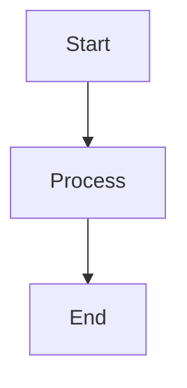

# Prela Documentation

This directory contains the complete documentation for Prela, built with [MkDocs Material](https://squidfunk.github.io/mkdocs-material/).

## Structure

```
docs/
├── index.md                    # Home page
├── getting-started/            # Installation & setup (3 pages)
├── concepts/                   # Core concepts (5 pages)
├── integrations/               # LLM SDK integrations (4 pages)
├── evals/                      # Evaluation framework (5 pages)
├── cli/                        # CLI reference (2 pages)
├── api/                        # API reference (4 pages)
├── examples/                   # Code examples (4 pages)
├── contributing.md             # Contribution guide
├── changelog.md                # Version history
└── mkdocs.yml                  # MkDocs configuration
```

**Total:** 30 documentation pages

## Prerequisites

Install MkDocs and required plugins:

```bash
pip install mkdocs-material mkdocstrings[python] pymdown-extensions
```

## Build Documentation

### Serve Locally

Start a local development server with live reload:

```bash
cd /Users/gw/prela
mkdocs serve
```

Visit: http://127.0.0.1:8000

Changes to markdown files will auto-reload the browser.

### Build Static Site

Generate static HTML files:

```bash
mkdocs build
```

Output: `site/` directory

### Deploy to GitHub Pages

Deploy directly to GitHub Pages:

```bash
mkdocs gh-deploy
```

This builds and pushes to the `gh-pages` branch.

## Documentation Features

### Material Theme

- **Dark/Light Mode**: Automatic theme switching
- **Navigation**: Tabbed navigation with sections
- **Search**: Full-text search with suggestions
- **Code Blocks**: Syntax highlighting with copy button
- **Mermaid Diagrams**: Architecture and sequence diagrams
- **Tabbed Content**: Multiple code examples per section

### mkdocstrings Integration

Auto-generated API documentation from Python docstrings:

```markdown
::: prela.core.Span
    options:
      show_source: true
```

Generates complete API reference from code.

### Markdown Extensions

- **Admonitions**: Note, warning, tip boxes
- **Code Highlighting**: Python, YAML, JSON, bash
- **Tables**: Markdown tables with sorting
- **Task Lists**: Interactive checkboxes
- **Emoji**: :rocket: :fire: :sparkles:

## Writing Documentation

### Create New Page

1. Create markdown file in appropriate directory:
   ```bash
   touch docs/concepts/new-concept.md
   ```

2. Add to `mkdocs.yml` navigation:
   ```yaml
   nav:
     - Concepts:
       - New Concept: concepts/new-concept.md
   ```

3. Write content using markdown

### Code Examples

Use fenced code blocks with language:

````markdown
```python
import prela

prela.init(service_name="my-agent")
```
````

### Tabbed Examples

Show multiple options:

````markdown
=== "OpenAI"
    ```python
    from openai import OpenAI
    ```

=== "Anthropic"
    ```python
    from anthropic import Anthropic
    ```
````

### Mermaid Diagrams

Add diagrams:

````markdown

````

### Admonitions

Highlight important information:

```markdown
!!! note
    This is a note

!!! warning
    This is a warning

!!! tip
    This is a tip
```

### API Documentation

Reference Python code:

```markdown
::: prela.core.Tracer
    options:
      show_source: true
      show_root_heading: true
```

## Linting & Validation

### Check Links

```bash
mkdocs build --strict
```

Fails on broken links or warnings.

### Spell Check

Install and run:

```bash
pip install pyspelling
pyspelling -c .pyspelling.yml
```

### Markdown Linting

```bash
pip install markdownlint-cli
markdownlint docs/
```

## CI/CD Integration

### GitHub Actions

```yaml
# .github/workflows/docs.yml
name: Deploy Docs

on:
  push:
    branches: [main]

jobs:
  deploy:
    runs-on: ubuntu-latest
    steps:
      - uses: actions/checkout@v3
      - uses: actions/setup-python@v4
        with:
          python-version: 3.x
      - run: pip install mkdocs-material mkdocstrings[python]
      - run: mkdocs gh-deploy --force
```

## Documentation Guidelines

### Style

- **Clear & Concise**: Short sentences, active voice
- **Code Examples**: Every concept has copy-paste examples
- **Progressive**: Basic → Advanced complexity
- **Cross-References**: Link related concepts
- **Consistent**: Same terminology throughout

### Structure

Each page should have:

1. **Title**: Clear, descriptive
2. **Introduction**: What this page covers
3. **Content**: Sections with examples
4. **Next Steps**: Links to related pages

### Code Examples

- **Working Code**: All examples are tested
- **Complete**: Include imports and setup
- **Annotated**: Comments explain key parts
- **Multiple**: Show different use cases

## Troubleshooting

### Port Already in Use

```bash
mkdocs serve -a 127.0.0.1:8001
```

### Build Fails

Check for:
- Broken internal links
- Missing files in nav
- Invalid YAML in frontmatter
- Python import errors (mkdocstrings)

### Diagrams Not Rendering

Ensure pymdown-extensions is installed:

```bash
pip install pymdown-extensions
```

## Resources

- [MkDocs Documentation](https://www.mkdocs.org/)
- [Material Theme](https://squidfunk.github.io/mkdocs-material/)
- [mkdocstrings](https://mkdocstrings.github.io/)
- [Mermaid Diagrams](https://mermaid.js.org/)
- [Markdown Guide](https://www.markdownguide.org/)

## Contributing

See [contributing.md](contributing.md) for documentation contribution guidelines.

## License

Documentation is licensed under CC BY 4.0.
Code examples in documentation are licensed under Apache 2.0 (same as Prela SDK).
