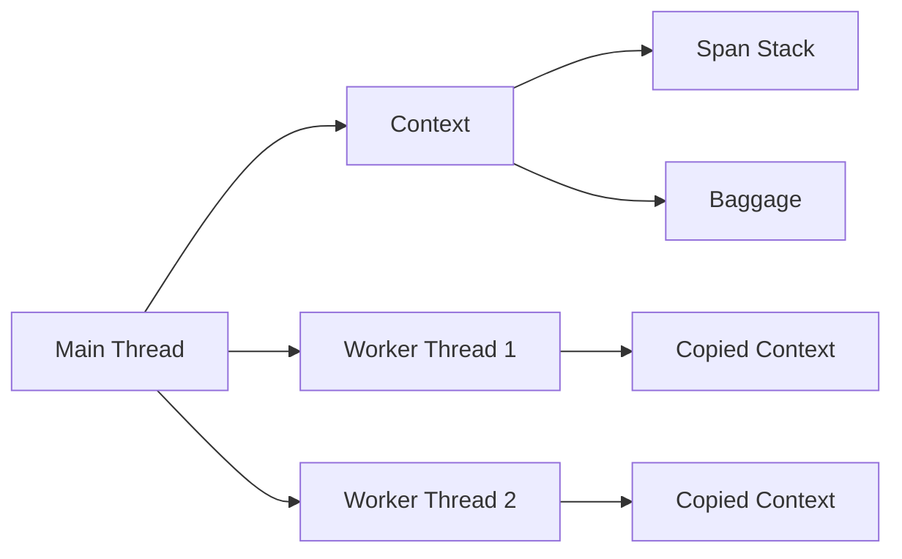

# Context Propagation

Context propagation is how Prela tracks the active span and trace across different parts of your application, including async code and thread pools.

## Overview

Prela uses Python's `contextvars` module for thread-safe and async-safe context storage. This enables:

- **Automatic span nesting**: Child spans automatically link to parent spans
- **Thread safety**: Each thread has its own context
- **Async support**: Context preserved across `await` boundaries
- **Baggage propagation**: Carry metadata through the trace



## How Context Works

### Automatic Context Management

When using the tracer's context manager, context is handled automatically:

```python
from prela import get_tracer, SpanType

# Context automatically created and managed
with get_tracer().span("parent_operation", SpanType.AGENT) as parent:
    # parent is now the active span

    with get_tracer().span("child_operation", SpanType.TOOL) as child:
        # child automatically becomes a child of parent
        # child.parent_span_id == parent.span_id
        pass

    # parent is active again after child ends
```

### Context Stack

Prela maintains a stack of active spans in the current context:

```python
from prela.core.context import get_current_span

with get_tracer().span("level_1") as span1:
    print(get_current_span().name)  # "level_1"

    with get_tracer().span("level_2") as span2:
        print(get_current_span().name)  # "level_2"

    print(get_current_span().name)  # "level_1" again
```

## Thread Safety

### The Problem

Python's `contextvars` don't automatically propagate to thread pool workers:

```python
from concurrent.futures import ThreadPoolExecutor

with get_tracer().span("parent") as parent:
    def worker():
        # This runs in a different thread
        # Context is LOST - get_current_span() returns None
        current = get_current_span()
        print(current)  # None

    with ThreadPoolExecutor() as executor:
        executor.submit(worker)  # Context not propagated!
```

### The Solution: copy_context_to_thread

Prela provides `copy_context_to_thread()` to propagate context to worker threads:

```python
from prela.core.context import copy_context_to_thread
from concurrent.futures import ThreadPoolExecutor

with get_tracer().span("parent") as parent:
    @copy_context_to_thread
    def worker():
        # Context is preserved!
        current = get_current_span()
        print(current.name)  # "parent"

        # Can create child spans
        with get_tracer().span("worker_task") as child:
            # child.parent_span_id == parent.span_id
            pass

    with ThreadPoolExecutor() as executor:
        # Wrap BEFORE submitting to pool
        executor.submit(worker)
```

### Important: Wrap Inside Context

The function must be wrapped **inside** the context you want to propagate:

```python
# ✅ CORRECT
with get_tracer().span("parent"):
    wrapped_func = copy_context_to_thread(my_function)
    executor.submit(wrapped_func)

# ❌ WRONG - wraps too early
wrapped_func = copy_context_to_thread(my_function)
with get_tracer().span("parent"):
    executor.submit(wrapped_func)  # No context to capture!
```

### Thread Pool Example

```python
from concurrent.futures import ThreadPoolExecutor, as_completed
from prela import get_tracer
from prela.core.context import copy_context_to_thread

def process_item(item_id):
    """Process a single item (runs in worker thread)."""
    with get_tracer().span(f"process_{item_id}") as span:
        span.set_attribute("item_id", item_id)
        # Processing logic
        return f"Result for {item_id}"

# Create parent span
with get_tracer().span("batch_processing") as parent:
    parent.set_attribute("batch_size", 10)

    # Wrap function INSIDE the parent span context
    wrapped_process = copy_context_to_thread(process_item)

    # Submit to thread pool
    with ThreadPoolExecutor(max_workers=4) as executor:
        futures = [
            executor.submit(wrapped_process, i)
            for i in range(10)
        ]

        # Collect results
        for future in as_completed(futures):
            result = future.result()
            print(result)

# All child spans are properly linked to parent!
```

## Async Support

Context automatically propagates across `async`/`await` boundaries:

```python
import asyncio
from prela import get_tracer, SpanType

async def fetch_data(url):
    """Async function with tracing."""
    with get_tracer().span("fetch", SpanType.RETRIEVAL) as span:
        span.set_attribute("url", url)
        await asyncio.sleep(0.1)  # Simulate async work
        return f"Data from {url}"

async def main():
    with get_tracer().span("async_main", SpanType.AGENT) as parent:
        # Context preserved across await
        result1 = await fetch_data("https://api1.com")
        result2 = await fetch_data("https://api2.com")

        # Both fetch spans are children of async_main
        return [result1, result2]

# Run
asyncio.run(main())
```

### Concurrent Async Tasks

```python
async def process_urls(urls):
    with get_tracer().span("process_batch") as parent:
        # Create concurrent tasks
        tasks = [fetch_data(url) for url in urls]

        # Each task maintains its own span context
        results = await asyncio.gather(*tasks)

        return results

# All spans properly linked
asyncio.run(process_urls(["url1", "url2", "url3"]))
```

## Manual Context Management

For advanced use cases, you can manually manage context:

### Creating a New Trace Context

```python
from prela.core.context import new_trace_context

# Create isolated trace context
with new_trace_context() as ctx:
    # ctx is a fresh TraceContext
    # No parent spans, clean slate

    with get_tracer().span("root_operation") as root:
        # This is a root span (no parent)
        assert root.parent_span_id is None
```

### Getting Current Context

```python
from prela.core.context import get_trace_context, get_current_span

# Get the entire context
ctx = get_trace_context()
print(ctx.trace_id)
print(ctx.baggage)

# Get just the current span
span = get_current_span()
if span:
    print(f"Currently in span: {span.name}")
else:
    print("No active span")
```

### Accessing Trace ID

```python
from prela.core.context import get_current_trace_id

with get_tracer().span("operation") as span:
    trace_id = get_current_trace_id()
    print(f"Trace ID: {trace_id}")

    # Use trace ID for correlation
    logger.info("Processing request", extra={"trace_id": trace_id})
```

## Baggage

Baggage allows you to carry key-value data through the entire trace:

```python
from prela.core.context import get_trace_context

with get_tracer().span("root") as root:
    # Set baggage at any point
    ctx = get_trace_context()
    ctx.baggage["user_id"] = "user123"
    ctx.baggage["request_id"] = "req456"

    # Baggage is available in child spans
    with get_tracer().span("child") as child:
        ctx = get_trace_context()
        user_id = ctx.baggage.get("user_id")  # "user123"
        print(f"Processing for user: {user_id}")
```

### Baggage in Thread Pools

Baggage is automatically propagated when using `copy_context_to_thread`:

```python
from prela.core.context import copy_context_to_thread, get_trace_context

with get_tracer().span("parent"):
    # Set baggage
    ctx = get_trace_context()
    ctx.baggage["session_id"] = "session789"

    @copy_context_to_thread
    def worker():
        # Baggage available in worker thread
        ctx = get_trace_context()
        session_id = ctx.baggage.get("session_id")
        print(f"Session: {session_id}")  # "session789"

    executor.submit(worker)
```

## Context Boundaries

### When Context is Preserved

✅ Context automatically propagates in these scenarios:

- **Same thread**: Sequential function calls
- **Async/await**: Across coroutine boundaries
- **With copy_context_to_thread**: Thread pool workers
- **Nested spans**: Child spans within parent spans

### When Context is Lost

❌ Context is **not** preserved in these scenarios:

- **New threads**: Without `copy_context_to_thread`
- **Process pools**: multiprocessing doesn't share context
- **Message queues**: Background job systems (Celery, RQ)
- **Different services**: Requires distributed tracing headers

```python
import multiprocessing

with get_tracer().span("parent"):
    def process_worker():
        # Context is LOST in process pools
        # multiprocessing creates new Python interpreter
        current = get_current_span()
        print(current)  # None

    with multiprocessing.Pool() as pool:
        pool.apply(process_worker)  # No context propagation
```

## Distributed Tracing

For distributed systems spanning multiple services, you need to propagate trace context via headers or metadata.

### Extracting Context for Propagation

```python
from prela.core.context import get_trace_context

with get_tracer().span("api_request") as span:
    ctx = get_trace_context()

    # Extract IDs for propagation
    headers = {
        "X-Trace-ID": ctx.trace_id,
        "X-Span-ID": span.span_id,
    }

    # Send to downstream service
    response = requests.get("https://api.example.com", headers=headers)
```

### Injecting Context from Headers

```python
from prela import Span, SpanType
from prela.core.context import new_trace_context

def handle_request(request):
    # Extract trace context from incoming headers
    trace_id = request.headers.get("X-Trace-ID")
    parent_span_id = request.headers.get("X-Span-ID")

    # Create span that continues the distributed trace
    with get_tracer().span("handle_request", SpanType.AGENT) as span:
        # Manually set trace context
        span.trace_id = trace_id
        span.parent_span_id = parent_span_id

        # Process request
        result = process(request)
        return result
```

## Best Practices

### 1. Always Use Context Managers

```python
# ✅ GOOD: Automatic context cleanup
with get_tracer().span("operation") as span:
    do_work()

# ❌ BAD: Manual management is error-prone
span = tracer.start_span("operation")
try:
    do_work()
finally:
    span.end()  # Easy to forget or miss in error paths
```

### 2. Wrap Thread Pool Functions Inside Context

```python
# ✅ GOOD: Wrap after entering context
with get_tracer().span("parent"):
    wrapped = copy_context_to_thread(worker_func)
    executor.submit(wrapped)

# ❌ BAD: Wrap before entering context
wrapped = copy_context_to_thread(worker_func)
with get_tracer().span("parent"):
    executor.submit(wrapped)  # No context to capture!
```

### 3. Use Baggage for Cross-Cutting Concerns

```python
# Store user/request IDs in baggage for all child spans
with get_tracer().span("handle_request") as span:
    ctx = get_trace_context()
    ctx.baggage["user_id"] = request.user_id
    ctx.baggage["request_id"] = request.id

    # All child spans can access these values
    process_request(request)
```

### 4. Check for Active Span Before Using

```python
from prela.core.context import get_current_span

# Safe access to current span
current = get_current_span()
if current:
    current.set_attribute("key", "value")
else:
    # No active tracing - graceful degradation
    pass
```

### 5. Use new_trace_context for Root Operations

```python
# Create isolated traces for background jobs
with new_trace_context():
    with get_tracer().span("background_job") as span:
        # This is a root span, not linked to any previous trace
        process_job()
```

## Troubleshooting

### Problem: Child spans not linking to parent

**Symptom**: `child.parent_span_id` is `None` when it should have a parent.

**Solution**: Ensure you're using the tracer's span context manager:

```python
# ✅ CORRECT
with get_tracer().span("parent"):
    with get_tracer().span("child"):
        pass  # child.parent_span_id is set

# ❌ WRONG
parent = Span(name="parent")
with get_tracer().span("child"):
    pass  # child.parent_span_id is None (parent not in context)
```

### Problem: Context lost in thread pool

**Symptom**: `get_current_span()` returns `None` in worker threads.

**Solution**: Use `copy_context_to_thread`:

```python
from prela.core.context import copy_context_to_thread

with get_tracer().span("parent"):
    @copy_context_to_thread
    def worker():
        span = get_current_span()  # Now works!

    executor.submit(worker)
```

### Problem: Baggage not propagating

**Symptom**: Baggage set in parent not available in child.

**Solution**: Ensure baggage is set before child span creation:

```python
with get_tracer().span("parent"):
    ctx = get_trace_context()
    ctx.baggage["key"] = "value"  # Set BEFORE child span

    with get_tracer().span("child"):
        # Baggage is now available
        value = get_trace_context().baggage.get("key")
```

## Next Steps

- Learn about [Sampling](sampling.md) to control trace volume
- Explore [Exporters](exporters.md) for sending traces to backends
- See [Custom Spans](../examples/custom-spans.md) for advanced patterns
