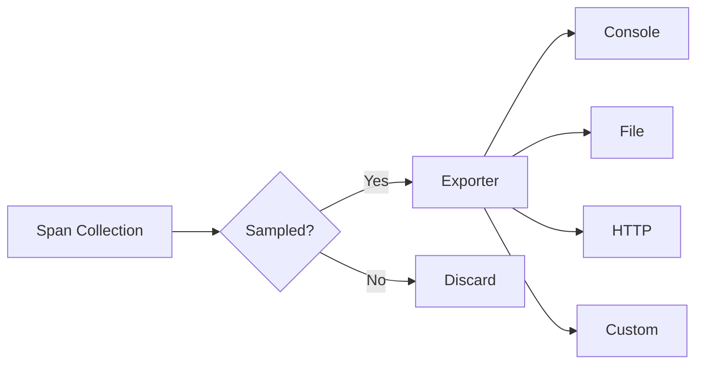

# Exporters

Exporters control where and how traces are sent after collection. Prela provides built-in exporters for common use cases and a flexible base class for custom implementations.

## Overview

Exporters are responsible for:

- **Serialization**: Converting spans to wire format
- **Transmission**: Sending traces to backend systems
- **Retry Logic**: Handling transient failures
- **Batching**: Grouping spans for efficiency



## Built-in Exporters

| Exporter | Use Case | Output |
|----------|----------|--------|
| `ConsoleExporter` | Development, debugging | Terminal output |
| `FileExporter` | Production, analysis | JSONL files |
| Custom | Integration | Your backend |

## ConsoleExporter

Pretty-prints traces to the console. Perfect for development and debugging.

### Basic Usage

```python
from prela import init

tracer = init(
    service_name="my-app",
    exporter="console"  # String shortcut
)
```

### Configuration

```python
from prela.exporters import ConsoleExporter

exporter = ConsoleExporter(
    verbosity="normal",      # "minimal", "normal", or "verbose"
    color=True,              # Enable colored output (requires rich library)
    show_timestamps=True,    # Show span start/end times
    show_attributes=True,    # Show span attributes
    show_events=True,        # Show span events
    indent=2                 # JSON indentation for verbose mode
)

tracer = init(service_name="my-app", exporter=exporter)
```

### Verbosity Levels

#### Minimal
Shows only span names and status:

```
✓ anthropic.messages.create (1.2s)
✓ process_query (1.5s)
```

#### Normal (Default)
Adds key attributes and timing:

```
✓ anthropic.messages.create (1.234s)
  model: claude-sonnet-4-20250514
  tokens: 150 → 89
  latency: 1234ms
```

#### Verbose
Full JSON output with all details:

```json
{
  "span_id": "550e8400-e29b-41d4-a716-446655440000",
  "trace_id": "123e4567-e89b-12d3-a456-426614174000",
  "name": "anthropic.messages.create",
  "span_type": "llm",
  "status": "success",
  "attributes": {
    "llm.model": "claude-sonnet-4-20250514",
    "llm.input_tokens": 150,
    "llm.output_tokens": 89
  },
  "events": [...],
  "duration_ms": 1234.5
}
```

### Example

```python
from prela import init

# Development: verbose output
tracer = init(
    service_name="dev-app",
    exporter="console",
    verbosity="verbose",
    color=True
)

# Demo: minimal output
tracer = init(
    service_name="demo-app",
    exporter="console",
    verbosity="minimal"
)
```

## FileExporter

Writes traces to JSONL files on disk. Production-ready with rotation and organization.

### Basic Usage

```python
from prela import init

tracer = init(
    service_name="my-app",
    exporter="file",
    directory="./traces"  # Output directory
)
```

### Configuration

```python
from prela.exporters import FileExporter

exporter = FileExporter(
    directory="./traces",           # Base directory
    format="jsonl",                  # Output format (currently only jsonl)
    max_file_size_mb=100,           # Max file size before rotation
    rotate=True,                    # Enable file rotation
    service_name="my-app"           # Service name for organization
)

tracer = init(service_name="my-app", exporter=exporter)
```

### File Organization

Traces are organized by service and date:

```
traces/
├── my-app/
│   ├── 2025-01-26/
│   │   ├── trace_550e8400.jsonl
│   │   ├── trace_661f9511.jsonl
│   │   └── trace_772fa622.jsonl
│   └── 2025-01-27/
│       └── trace_883gb733.jsonl
└── another-service/
    └── 2025-01-26/
        └── trace_994hc844.jsonl
```

### File Format

Each file contains one JSON object per line (JSONL):

```jsonl
{"span_id":"550e8400...","trace_id":"123e4567...","name":"llm_call",...}
{"span_id":"661f9511...","trace_id":"123e4567...","name":"tool_call",...}
{"span_id":"772fa622...","trace_id":"123e4567...","name":"retrieval",...}
```

### File Rotation

When `rotate=True`, files automatically rotate at `max_file_size_mb`:

```python
exporter = FileExporter(
    directory="./traces",
    max_file_size_mb=50,  # Rotate at 50MB
    rotate=True
)

# Creates numbered files:
# trace_550e8400.jsonl       (original)
# trace_550e8400.jsonl.1     (rotated)
# trace_550e8400.jsonl.2     (rotated again)
```

### Thread Safety

`FileExporter` is thread-safe and can be used from multiple threads:

```python
from concurrent.futures import ThreadPoolExecutor
from prela import init, get_tracer

tracer = init(service_name="app", exporter="file")

def worker(i):
    with get_tracer().span(f"task_{i}") as span:
        # Safe: multiple threads writing to same exporter
        span.set_attribute("worker_id", i)

with ThreadPoolExecutor(max_workers=10) as executor:
    executor.map(worker, range(100))
```

### Example

```python
from prela import init

# Production configuration
tracer = init(
    service_name="production-api",
    exporter="file",
    directory="/var/log/traces",
    max_file_size_mb=100,
    rotate=True
)

# Staging: smaller files
tracer = init(
    service_name="staging-api",
    exporter="file",
    directory="./traces",
    max_file_size_mb=10,
    rotate=True
)
```

## Custom Exporters

Create custom exporters for integration with your backend.

### BaseExporter Interface

```python
from prela.exporters import BaseExporter, ExportResult
from prela import Span

class MyExporter(BaseExporter):
    """Custom exporter for my backend."""

    def export(self, spans: list[Span]) -> ExportResult:
        """Export spans to backend.

        Args:
            spans: List of spans to export

        Returns:
            ExportResult.SUCCESS: Export succeeded
            ExportResult.FAILURE: Permanent failure, don't retry
            ExportResult.RETRY: Transient failure, retry later
        """
        try:
            # Serialize spans
            data = [span.to_dict() for span in spans]

            # Send to backend
            response = self.send_to_backend(data)

            if response.status_code == 200:
                return ExportResult.SUCCESS
            elif response.status_code >= 500:
                # Transient error, retry
                return ExportResult.RETRY
            else:
                # Permanent error, don't retry
                return ExportResult.FAILURE

        except Exception as e:
            # Unexpected error, retry
            print(f"Export failed: {e}")
            return ExportResult.RETRY

    def send_to_backend(self, data):
        # Your backend integration here
        pass
```

### Using Custom Exporter

```python
from prela import init

# Initialize with custom exporter
tracer = init(
    service_name="my-app",
    exporter=MyExporter()
)
```

## BatchExporter

For high-volume scenarios, extend `BatchExporter` for automatic batching and retry logic:

```python
from prela.exporters.base import BatchExporter, ExportResult
from prela import Span
import requests

class HTTPExporter(BatchExporter):
    """Export traces via HTTP."""

    def __init__(self, endpoint: str, api_key: str, batch_size: int = 100):
        super().__init__(
            batch_size=batch_size,
            timeout_ms=5000,           # 5 second timeout
            max_retries=3,             # Retry up to 3 times
            initial_backoff_ms=100,    # Start with 100ms backoff
            max_backoff_ms=10000       # Cap at 10 seconds
        )
        self.endpoint = endpoint
        self.api_key = api_key

    def _do_export(self, spans: list[Span]) -> ExportResult:
        """Implement actual export logic."""
        try:
            response = requests.post(
                self.endpoint,
                json=[span.to_dict() for span in spans],
                headers={"Authorization": f"Bearer {self.api_key}"},
                timeout=self.timeout_ms / 1000
            )

            if response.status_code == 200:
                return ExportResult.SUCCESS
            elif response.status_code >= 500:
                return ExportResult.RETRY
            else:
                return ExportResult.FAILURE

        except requests.Timeout:
            return ExportResult.RETRY
        except requests.ConnectionError:
            return ExportResult.RETRY
        except Exception:
            return ExportResult.FAILURE


# Use with batching
tracer = init(
    service_name="my-app",
    exporter=HTTPExporter(
        endpoint="https://api.example.com/traces",
        api_key="your-api-key",
        batch_size=50  # Send in batches of 50
    )
)
```

## Export Results

Exporters return one of three results:

### SUCCESS
Export completed successfully. Span data is safe.

```python
def export(self, spans):
    send_to_backend(spans)
    return ExportResult.SUCCESS
```

### FAILURE
Permanent failure. Don't retry (e.g., invalid data, auth failure).

```python
def export(self, spans):
    response = send_to_backend(spans)
    if response.status_code == 401:
        # Auth failure, don't retry
        return ExportResult.FAILURE
    return ExportResult.SUCCESS
```

### RETRY
Transient failure. Will retry with exponential backoff.

```python
def export(self, spans):
    try:
        send_to_backend(spans)
        return ExportResult.SUCCESS
    except TimeoutError:
        # Network issue, retry
        return ExportResult.RETRY
```

## Retry Logic

`BatchExporter` implements exponential backoff:

```python
# Retry schedule with default settings:
# Attempt 1: immediate
# Attempt 2: after 100ms
# Attempt 3: after 200ms
# Attempt 4: after 400ms
# ...up to max_backoff_ms

exporter = BatchExporter(
    initial_backoff_ms=100,   # Start backoff
    max_backoff_ms=10000,     # Cap backoff
    max_retries=5             # Max attempts
)
```

## Multiple Exporters

Send traces to multiple destinations:

```python
from prela.exporters import BaseExporter, ExportResult

class MultiExporter(BaseExporter):
    """Export to multiple backends."""

    def __init__(self, *exporters: BaseExporter):
        self.exporters = exporters

    def export(self, spans):
        results = [exp.export(spans) for exp in self.exporters]

        # Return RETRY if any exporter wants to retry
        if ExportResult.RETRY in results:
            return ExportResult.RETRY

        # Return FAILURE if any exporter failed
        if ExportResult.FAILURE in results:
            return ExportResult.FAILURE

        return ExportResult.SUCCESS


# Use multiple exporters
from prela.exporters import ConsoleExporter, FileExporter

tracer = init(
    service_name="my-app",
    exporter=MultiExporter(
        ConsoleExporter(verbosity="minimal"),
        FileExporter(directory="./traces")
    )
)
```

## Best Practices

### 1. Use ConsoleExporter in Development

```python
# Development
tracer = init(
    service_name="dev-app",
    exporter="console",
    verbosity="verbose"
)
```

### 2. Use FileExporter in Production

```python
# Production
tracer = init(
    service_name="prod-app",
    exporter="file",
    directory="/var/log/traces",
    max_file_size_mb=100,
    rotate=True
)
```

### 3. Implement Proper Error Handling

```python
class RobustExporter(BaseExporter):
    def export(self, spans):
        try:
            # Export logic
            return ExportResult.SUCCESS
        except ValueError:
            # Bad data, don't retry
            return ExportResult.FAILURE
        except (TimeoutError, ConnectionError):
            # Network issue, retry
            return ExportResult.RETRY
        except Exception as e:
            # Unknown error, log and fail
            logger.error(f"Export failed: {e}")
            return ExportResult.FAILURE
```

### 4. Set Appropriate Timeouts

```python
class TimeoutAwareExporter(BatchExporter):
    def __init__(self):
        super().__init__(
            timeout_ms=5000,  # 5 second total timeout
            max_retries=3     # Retry up to 3 times
        )

    def _do_export(self, spans):
        # Implementation with timeout enforcement
        pass
```

### 5. Monitor Export Success

```python
class MonitoredExporter(BaseExporter):
    def __init__(self, base_exporter):
        self.base_exporter = base_exporter
        self.success_count = 0
        self.failure_count = 0

    def export(self, spans):
        result = self.base_exporter.export(spans)

        if result == ExportResult.SUCCESS:
            self.success_count += 1
        else:
            self.failure_count += 1

        # Log metrics
        logger.info(
            f"Export stats: {self.success_count} success, "
            f"{self.failure_count} failures"
        )

        return result
```

## Troubleshooting

### Problem: Traces not appearing

**Check exporter configuration:**

```python
from prela import get_tracer

tracer = get_tracer()
print(f"Exporter: {tracer.exporter}")
print(f"Sampler: {tracer.sampler}")
```

### Problem: File exporter creating too many files

**Increase file size limit:**

```python
exporter = FileExporter(
    directory="./traces",
    max_file_size_mb=500,  # Larger files
    rotate=True
)
```

### Problem: Export failures

**Enable debug logging:**

```bash
export PRELA_DEBUG=true
```

```python
import logging
logging.basicConfig(level=logging.DEBUG)

tracer = init(service_name="app", exporter="file")
# Logs will show export attempts and failures
```

## Next Steps

- Learn about [Sampling](sampling.md) to control trace volume
- See [Production Setup](../examples/production.md) for deployment patterns
- Explore [Custom Spans](../examples/custom-spans.md) for advanced usage
