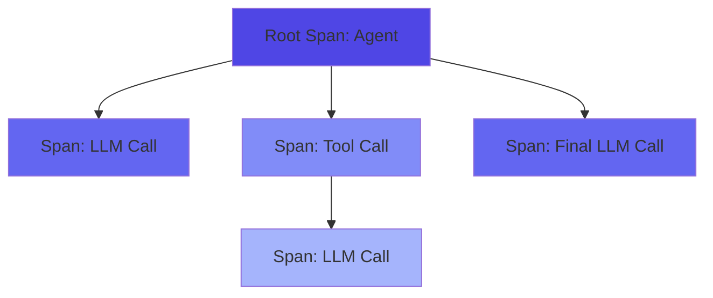

# Deterministic Replay

Re-execute captured traces with parameter modifications and compare results.

---

## What is Replay?

**Replay** enables you to re-execute previously captured traces in two modes:

1. **Exact Replay**: Deterministic re-execution using cached data (no API calls, identical results)
2. **Modified Replay**: Re-execution with parameter changes (makes real API calls for modified spans)

This is powerful for:

- **A/B Testing**: Compare different models (GPT-4 vs Claude)
- **Parameter Tuning**: Test temperature, max_tokens, system prompts
- **Regression Testing**: Ensure new versions produce similar outputs
- **Cost Optimization**: Experiment with cheaper models
- **Debugging**: Reproduce issues from production traces

---

## How Replay Works

### Replay Capture (Automatic)

When you enable replay capture, Prela automatically records additional data:

```python
import prela

# Enable replay capture
tracer = prela.init(
    service_name="my-agent",
    exporter="file",
    file_path="traces.jsonl",
    capture_for_replay=True  # ← Enable replay
)
```

Captured data includes:

- **LLM Requests**: Model, temperature, max_tokens, system_prompt, messages
- **LLM Responses**: Full response text, token usage, finish_reason
- **Tool Calls**: Function names, arguments, results
- **Retrieval Operations**: Queries, documents, similarity scores
- **Agent State**: Memory, context, configuration

### Replay Execution

Load and replay a trace:

```python
from prela.replay import ReplayEngine
from prela.replay.loader import TraceLoader

# Load trace from file
trace = TraceLoader.from_file("traces.jsonl")

# Create replay engine
engine = ReplayEngine(trace)

# Exact replay (no API calls)
result = engine.replay_exact()

print(f"Duration: {result.total_duration_ms}ms")
print(f"Tokens: {result.total_tokens}")
print(f"Cost: ${result.total_cost_usd:.4f}")
```

---

## Replay Modes

### 1. Exact Replay

Re-execute using captured data without API calls:

```python
# Deterministic, fast, free
result = engine.replay_exact()
```

**Characteristics:**

- ✅ **Deterministic**: Always produces identical results
- ✅ **Fast**: ~1ms per span (no network calls)
- ✅ **Free**: No API costs
- ✅ **Offline**: Works without API access

**Use Cases:**

- Verify trace completeness
- Measure baseline performance
- Test comparison engine
- Debugging without costs

### 2. Modified Replay

Re-execute with parameter changes (makes real API calls):

```python
# Change model and temperature
result = engine.replay_with_modifications(
    model="gpt-4o",
    temperature=0.7
)
```

**Available Modifications:**

| Parameter | Description | Example |
|-----------|-------------|---------|
| `model` | Change LLM model | `"gpt-4o"`, `"claude-sonnet-4"` |
| `temperature` | Adjust randomness | `0.0` (deterministic) to `1.0` (creative) |
| `system_prompt` | Override system instructions | `"You are a helpful assistant"` |
| `max_tokens` | Change output length limit | `512`, `1024`, `4096` |
| `mock_tool_responses` | Override tool outputs | `{"search": {"results": [...]}}` |
| `mock_retrieval_results` | Override retrieval results | `{"query": {"documents": [...]}}` |

**Selective Re-execution:**

Only modified spans make real API calls. Unmodified spans use cached data:

```python
# Only LLM spans with gpt-4 → gpt-4o will call API
result = engine.replay_with_modifications(model="gpt-4o")

# If original trace used 3 LLM calls:
# - 3 API calls are made (one per modified span)
# - Tool calls use cached data
# - Retrieval uses cached data
```

---

## Comparing Replays

Compare two replay results to see differences:

```python
from prela.replay import compare_replays

# Exact replay (baseline)
original = engine.replay_exact()

# Modified replay (experiment)
modified = engine.replay_with_modifications(
    model="gpt-4o",
    temperature=0.5
)

# Compare
comparison = compare_replays(original, modified)

# Print summary
print(comparison.generate_summary())
```

### Comparison Output

```
Replay Comparison Summary
========================

Total Spans: 5
Spans with Differences: 3

Changes:
- Output differences: 3 spans
- Token changes: 2 spans (+150 tokens)
- Cost changes: 2 spans (+$0.0045)
- Duration changes: 3 spans (+234ms)

Span-by-Span Differences:

1. anthropic.messages.create
   ✗ Output changed (semantic similarity: 85.3%)
   ✗ Tokens: 450 → 600 (+150)
   ✗ Cost: $0.0090 → $0.0135 (+$0.0045)
   ✗ Duration: 823ms → 1057ms (+234ms)

2. langchain.tool.search
   ✓ No differences (cached data used)

3. anthropic.messages.create
   ✗ Output changed (semantic similarity: 92.1%)
   ✓ Tokens unchanged (cached)
   ✗ Duration: 756ms → 891ms (+135ms)
```

### Difference Types

| Difference | Description | When It Appears |
|------------|-------------|-----------------|
| **Output** | Response text changed | Modified LLM spans |
| **Input** | Request changed | Modified prompts |
| **Tokens** | Token usage changed | Model change, output length change |
| **Cost** | API cost changed | Model change, token change |
| **Duration** | Execution time changed | Real API calls vs cached |
| **Status** | Success → Error (or vice versa) | API failures, timeouts |
| **Semantic Similarity** | Cosine similarity of embeddings | Requires sentence-transformers |

---

## Semantic Similarity

Compare text outputs semantically (requires optional dependency):

```bash
pip install sentence-transformers
```

The comparison engine uses embeddings to measure similarity:

```python
comparison = compare_replays(original, modified)

for diff in comparison.differences:
    if diff.semantic_similarity:
        if diff.semantic_similarity > 0.9:
            print(f"{diff.span_name}: Highly similar ({diff.semantic_similarity:.1%})")
        elif diff.semantic_similarity > 0.7:
            print(f"{diff.span_name}: Moderately similar ({diff.semantic_similarity:.1%})")
        else:
            print(f"{diff.span_name}: Low similarity ({diff.semantic_similarity:.1%})")
```

**Interpretation:**

- **> 90%**: Nearly identical meaning (paraphrases)
- **70-90%**: Similar concepts, different wording
- **50-70%**: Related but divergent responses
- **< 50%**: Significantly different outputs

---

## Automatic Retry Logic

Prela automatically retries failed API calls with exponential backoff.

### How It Works

When an API call fails with a transient error (rate limit, timeout, connection issue), Prela:

1. Detects if error is retryable
2. Waits with exponential backoff
3. Retries up to configured maximum
4. Tracks retry count per span

**Retryable Errors:**

- HTTP 429 (Rate Limit)
- HTTP 503 (Service Unavailable)
- HTTP 502 (Bad Gateway)
- Connection timeouts
- Network errors

**Non-Retryable Errors:**

- Authentication failures (401, 403)
- Invalid requests (400)
- Not found (404)

### Configuration

```python
from prela.replay import ReplayEngine

# Default: 3 retries, 1s initial delay, 60s max
engine = ReplayEngine(trace)

# Custom: More aggressive retry for flaky networks
engine = ReplayEngine(
    trace,
    max_retries=5,
    retry_initial_delay=2.0,
    retry_max_delay=120.0,
    retry_exponential_base=2.0,
)

# Fast-fail: Minimal retries
engine = ReplayEngine(
    trace,
    max_retries=1,
    retry_initial_delay=0.5,
)
```

### Exponential Backoff

Delays double with each retry (capped at max_delay):

- Attempt 0: No delay (initial request)
- Attempt 1: 1.0s delay
- Attempt 2: 2.0s delay
- Attempt 3: 4.0s delay
- Attempt 4: 8.0s delay (capped at max_delay)

### Monitoring Retries

```python
result = engine.replay_with_modifications(model="gpt-4o")

# Check which spans required retries
for span in result.spans:
    if span.retry_count > 0:
        print(f"⚠️  {span.name} required {span.retry_count} retries")
```

---

## Semantic Similarity Fallback

Prela provides intelligent fallback when `sentence-transformers` is unavailable.

### Fallback Strategy

**Without sentence-transformers** (fallback):

1. **Exact Match** (fastest) - Returns 1.0 for identical strings
2. **difflib.SequenceMatcher** (primary) - Edit distance-based similarity (0.0-1.0)
3. **Jaccard Word Similarity** (secondary) - Word overlap measurement (0.0-1.0)

**With sentence-transformers** (best accuracy):

- Uses `all-MiniLM-L6-v2` embedding model
- Computes cosine similarity between embeddings
- Better for paraphrasing and semantic equivalence

### Performance Comparison

| Method | Speed | Accuracy | Use Case |
|--------|-------|----------|----------|
| Exact match | Instant | Perfect for identical text | Quick check |
| difflib | ~1-5ms | Good for typos, minor edits | General use |
| Jaccard | ~1-5ms | Good for word reordering | Paraphrasing |
| Embeddings | ~10-50ms | Best for semantic similarity | Production |

### difflib Accuracy

```python
# Same text, different case
"Hello World" vs "hello world" → 0.82 (82%)

# Minor edit
"brown fox" vs "red fox" → 0.85 (85%)

# Word reorder
"cat dog bird" vs "dog bird cat" → 0.67 (67%)

# Completely different
"apple" vs "orange" → 0.0 (0%)
```

### When to Install sentence-transformers

Install for production use when you need:

- Paraphrase detection ("quick" vs "fast")
- Semantic equivalence ("start" vs "begin")
- High accuracy requirements

```bash
pip install prela[similarity]  # Installs sentence-transformers (~500MB)
```

### Checking Availability

```python
from prela.replay import compare_replays

comparison = compare_replays(original, modified)

if comparison.semantic_similarity_available:
    print(f"Using embeddings: {comparison.semantic_similarity_model}")
else:
    print("Using fallback: difflib + Jaccard")
```

---

## Tool Re-execution

Re-execute tools during replay instead of using cached data.

### 3-Tier Priority System

For tool spans, Prela uses this priority order:

1. **Mock responses** (highest) - Always used if provided
2. **Real execution** - Used if enabled, mocks not provided
3. **Cached data** (default) - Original captured output

This prevents accidental execution while allowing controlled testing.

### Basic Usage

```python
# Define tool functions
def my_calculator(input_data):
    return {"result": input_data["a"] + input_data["b"]}

def my_search(input_data):
    # Actual search implementation
    return {"results": [...]}

# Create tool registry
tool_registry = {
    "calculator": my_calculator,
    "search": my_search,
}

# Re-execute tools
result = engine.replay_with_modifications(
    enable_tool_execution=True,
    tool_registry=tool_registry,
)
```

### Safety Controls

**Allowlist** (only execute specific tools):

```python
result = engine.replay_with_modifications(
    enable_tool_execution=True,
    tool_execution_allowlist=["calculator", "search"],  # Only these
    tool_registry=tool_registry,
)
```

**Blocklist** (never execute specific tools):

```python
result = engine.replay_with_modifications(
    enable_tool_execution=True,
    tool_execution_blocklist=["delete_file", "shutdown"],  # Block these
    tool_registry=tool_registry,
)
```

**Note:** Blocklist takes precedence over allowlist.

### Use Cases

**Testing with Different Tool Implementations:**

```python
# Original used production API
# Replay with mock API for testing
def mock_api(input_data):
    return {"status": "success", "data": "test"}

tool_registry = {"api_call": mock_api}

result = engine.replay_with_modifications(
    enable_tool_execution=True,
    tool_execution_allowlist=["api_call"],
    tool_registry=tool_registry,
)
```

**Debugging with Fresh Data:**

```python
# Re-run search tool to see if results changed
def fresh_search(input_data):
    # Query current database
    return {...}

result = engine.replay_with_modifications(
    enable_tool_execution=True,
    tool_execution_allowlist=["search"],
    tool_registry={"search": fresh_search},
)
```

---

## Retrieval Re-execution

Re-query vector databases during replay to test with updated data.

### 3-Tier Priority System

For retrieval spans, Prela uses this priority order:

1. **Mock results** (highest) - Always used if provided
2. **Real execution** - Re-queries if enabled, mocks not provided
3. **Cached data** (default) - Original retrieved documents

### Supported Vector Databases

- ✅ **ChromaDB** - Fully implemented
- ⚠️ **Pinecone** - Requires embedding model (placeholder)
- ⚠️ **Qdrant** - Requires embedding model (placeholder)
- ⚠️ **Weaviate** - Requires class name (placeholder)

### ChromaDB Example

```python
import chromadb

# Setup ChromaDB client
client = chromadb.Client()
collection = client.create_collection("my_docs")

# Add some documents
collection.add(
    documents=["Updated document 1", "Updated document 2"],
    ids=["1", "2"],
)

# Re-query with current data
result = engine.replay_with_modifications(
    enable_retrieval_execution=True,
    retrieval_client=collection,
)
```

### Query Override

Change retrieval query during replay:

```python
# Original query: "What is Python?"
# Test with different query
result = engine.replay_with_modifications(
    enable_retrieval_execution=True,
    retrieval_client=collection,
    retrieval_query_override="What is JavaScript?",
)
```

### Use Cases

**Testing with Updated Vector Store:**

```python
# Original trace used old embeddings
# Replay with newly indexed documents
new_client = chromadb.Client()
# ... add updated documents ...

result = engine.replay_with_modifications(
    enable_retrieval_execution=True,
    retrieval_client=new_client,
)
```

**A/B Testing Retrieval Strategies:**

```python
queries = [
    "Direct question",
    "Rephrased question",
    "Keywords only",
]

results = {}
for query in queries:
    results[query] = engine.replay_with_modifications(
        enable_retrieval_execution=True,
        retrieval_client=client,
        retrieval_query_override=query,
    )
```

---

## Cost Estimation

Estimate costs without making API calls:

```python
# Load trace
trace = TraceLoader.from_file("traces.jsonl")
engine = ReplayEngine(trace)

# Estimate cost of replay with different model
result = engine.replay_exact()  # No API calls

print(f"Original cost: ${result.total_cost_usd:.4f}")
print(f"Total tokens: {result.total_tokens}")

# Estimate new cost by inspecting token usage
# (Actual API call costs will vary slightly)
```

**Supported Models:**

- OpenAI: gpt-4, gpt-4o, gpt-3.5-turbo, o1-preview, o1-mini
- Anthropic: claude-3-opus, claude-3-sonnet, claude-3-haiku, claude-sonnet-4

---

## Loading Traces

### From File

```python
from prela.replay.loader import TraceLoader

# JSON file (single trace)
trace = TraceLoader.from_file("trace.json")

# JSONL file (picks first trace)
trace = TraceLoader.from_file("traces.jsonl")
```

### From Dictionary

```python
# From exported trace dict
trace_dict = {
    "trace_id": "abc-123",
    "spans": [...]
}
trace = TraceLoader.from_dict(trace_dict)
```

### From Span List

```python
# From list of Span objects
from prela.core import Span

spans = [span1, span2, span3]
trace = TraceLoader.from_spans(spans)
```

---

## CLI Usage

Replay traces from the command line:

```bash
# Exact replay
prela replay trace.json

# Modified replay with comparison
prela replay trace.json --model gpt-4o --compare

# Override multiple parameters
prela replay trace.json \
  --model claude-sonnet-4 \
  --temperature 0.7 \
  --system-prompt "You are an expert assistant" \
  --output result.json

# Save comparison report
prela replay trace.json --model gpt-4o --compare --output comparison.json
```

**CLI Options:**

| Option | Description | Example |
|--------|-------------|---------|
| `--model` | Override model | `--model gpt-4o` |
| `--temperature` | Set temperature | `--temperature 0.7` |
| `--system-prompt` | Override system prompt | `--system-prompt "Be concise"` |
| `--max-tokens` | Set max tokens | `--max-tokens 1024` |
| `--compare` | Compare with original | `--compare` |
| `--output` | Save result to file | `--output result.json` |

---

## Architecture

### Trace Tree Reconstruction

Traces are loaded and organized into a tree structure:



**Depth-First Execution:**

Spans are replayed in depth-first order to match original execution:

1. Root span starts
2. First child executes completely (including its children)
3. Second child executes completely
4. And so on...

This ensures parent-child dependencies are respected.

### Selective API Calls

The replay engine determines which spans need real API calls:

```python
def _span_needs_modification(span):
    if span.span_type != SpanType.LLM:
        return False  # Only LLM spans can be modified

    if modifications.get("model") and span.model != modifications["model"]:
        return True  # Model changed

    if modifications.get("temperature") and span.temperature != modifications["temperature"]:
        return True  # Temperature changed

    # ... check other parameters

    return False  # Use cached data
```

**Optimization:**

- Only modified spans call APIs
- Cached data used for unchanged spans
- Significant cost and latency savings

---

## Best Practices

### 1. Enable Replay Selectively

Only enable replay capture when needed:

```python
# Production: No replay (minimal overhead)
prela.init(service_name="prod", capture_for_replay=False)

# Development: Enable replay
prela.init(service_name="dev", capture_for_replay=True)
```

### 2. Use Exact Replay First

Always start with exact replay to verify completeness:

```python
engine = ReplayEngine(trace)
result = engine.replay_exact()

if not result.spans:
    print("Warning: Trace has no replay data")
    return
```

### 3. Compare Semantically

Use semantic similarity for meaningful comparisons:

```python
comparison = compare_replays(original, modified)

for diff in comparison.differences:
    if diff.field == "output" and diff.semantic_similarity:
        if diff.semantic_similarity < 0.7:
            print(f"⚠️  Significant divergence in {diff.span_name}")
```

### 4. Batch Experiments

Test multiple configurations efficiently:

```python
models = ["gpt-4", "gpt-4o", "claude-sonnet-4"]
temperatures = [0.0, 0.5, 1.0]

results = {}
for model in models:
    for temp in temperatures:
        key = f"{model}_temp{temp}"
        results[key] = engine.replay_with_modifications(
            model=model,
            temperature=temp
        )

# Compare all results
for key, result in results.items():
    print(f"{key}: ${result.total_cost_usd:.4f}, {result.total_tokens} tokens")
```

### 5. Store Comparisons

Save comparison reports for analysis:

```python
comparison = compare_replays(original, modified)

# Save to JSON
import json
with open("comparison.json", "w") as f:
    json.dump({
        "summary": comparison.generate_summary(),
        "differences": [
            {
                "span": diff.span_name,
                "field": diff.field,
                "similarity": diff.semantic_similarity
            }
            for diff in comparison.differences
        ]
    }, f, indent=2)
```

---

## Limitations

### 1. Tool Side Effects

Tools with side effects cannot be replayed safely:

```python
# ❌ Cannot replay safely
def send_email(to, subject, body):
    smtp.send(to, subject, body)  # Side effect!

# ✅ Use mocking for side effects
result = engine.replay_with_modifications(
    mock_tool_responses={
        "send_email": {"status": "sent", "message_id": "mock-123"}
    }
)
```

### 2. Streaming Responses

Streaming is supported with real-time output:

```python
from prela.replay import ReplayEngine
from prela.replay.loader import TraceLoader

# Load trace
trace = TraceLoader.from_file("trace.json")
engine = ReplayEngine(trace)

# Replay with streaming enabled
def on_chunk(chunk: str):
    print(chunk, end="", flush=True)

result = engine.replay_with_modifications(
    model="gpt-4o",
    stream=True,
    stream_callback=on_chunk
)
```

**Note**: Streaming works for both OpenAI and Anthropic models during replay execution.

### 3. Vendor Support

Currently supports OpenAI and Anthropic only:

- ✅ OpenAI (gpt-*, o1-*)
- ✅ Anthropic (claude-*)
- ❌ Other vendors (use exact replay only)

---

## Performance

### Exact Replay

- **Speed**: ~1ms per span
- **Memory**: O(n) where n = number of spans
- **Cost**: $0 (no API calls)

### Modified Replay

- **Speed**: Depends on API latency
- **Memory**: O(n) + API response buffers
- **Cost**: Only modified LLM spans charged

### Comparison

- **Speed**: ~10-50ms per comparison (with embeddings)
- **Memory**: O(n) for difference list
- **Accuracy**: 70%+ similarity for semantically similar texts

---

## API Reference

See [Replay API Documentation](../api/replay.md) for detailed API reference.

---

## Next Steps

- **[Replay Examples](../examples/replay.md)**: Practical examples and recipes
- **[CLI Commands](../cli/commands.md#replay)**: Command-line replay reference
- **[API Reference](../api/replay.md)**: Complete API documentation
