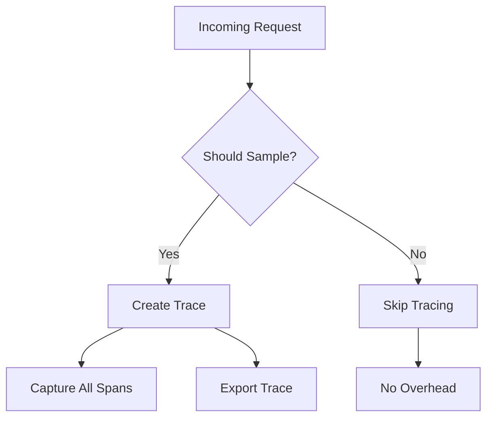
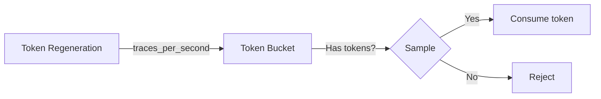

# Sampling

Sampling controls which traces are captured and exported. In production systems with high traffic, sampling every trace can be prohibitively expensive. Prela provides multiple sampling strategies to balance observability with performance.

## Overview

Sampling decisions are made at the **trace level** (not individual spans). Once a trace is sampled, all spans in that trace are captured. This ensures complete trace data for sampled requests.



## Sampling Strategies

Prela provides four built-in samplers:

| Sampler | Use Case | Overhead |
|---------|----------|----------|
| `AlwaysOnSampler` | Development, debugging | Highest |
| `AlwaysOffSampler` | Disable tracing | None |
| `ProbabilitySampler` | Production (probabilistic) | Medium |
| `RateLimitingSampler` | Production (rate limiting) | Low |

## AlwaysOnSampler

Samples every trace. Useful for development and low-traffic environments.

```python
from prela import init
from prela.core.sampler import AlwaysOnSampler

tracer = init(
    service_name="my-app",
    sampler=AlwaysOnSampler()
)

# Or use sample_rate=1.0
tracer = init(service_name="my-app", sample_rate=1.0)
```

**Characteristics**:
- ✅ Complete observability
- ✅ Simple and predictable
- ❌ Not suitable for high-traffic production
- ❌ Can generate massive trace volumes

## AlwaysOffSampler

Never samples traces. Useful for temporarily disabling tracing.

```python
from prela import init
from prela.core.sampler import AlwaysOffSampler

tracer = init(
    service_name="my-app",
    sampler=AlwaysOffSampler()
)

# Or use sample_rate=0.0
tracer = init(service_name="my-app", sample_rate=0.0)
```

**Characteristics**:
- ✅ Zero overhead
- ✅ Instant disable without code changes
- ❌ No observability

**Environment Variable**:
```bash
# Disable tracing via environment
export PRELA_SAMPLE_RATE=0.0
```

## ProbabilitySampler

Samples traces with a given probability (0.0 to 1.0). Uses deterministic hashing to ensure consistent sampling decisions for the same trace ID.

```python
from prela import init
from prela.core.sampler import ProbabilitySampler

# Sample 10% of traces
tracer = init(
    service_name="my-app",
    sampler=ProbabilitySampler(rate=0.1)
)

# Or use sample_rate parameter
tracer = init(service_name="my-app", sample_rate=0.1)
```

### How It Works

1. Compute MD5 hash of trace ID
2. Convert hash to float (0.0 to 1.0)
3. Sample if hash value < sampling rate

**Key Property**: The same trace ID always produces the same sampling decision across all services in a distributed system.

```python
from prela.core.sampler import ProbabilitySampler

sampler = ProbabilitySampler(rate=0.1)

trace_id = "550e8400-e29b-41d4-a716-446655440000"
result1 = sampler.should_sample(trace_id)  # True or False
result2 = sampler.should_sample(trace_id)  # Same as result1

# Deterministic: same trace_id = same decision
assert result1 == result2
```

### Configuration

```python
# Sample 1% of traces (recommended for high-traffic production)
ProbabilitySampler(rate=0.01)

# Sample 25% of traces (moderate traffic)
ProbabilitySampler(rate=0.25)

# Sample 50% of traces (development/staging)
ProbabilitySampler(rate=0.5)
```

**Characteristics**:
- ✅ Predictable sampling rate
- ✅ Deterministic (consistent across services)
- ✅ Low computational overhead
- ❌ Can miss rare events
- ❌ Not aware of system load

## RateLimitingSampler

Limits traces to a maximum rate (traces per second). Uses a token bucket algorithm.

```python
from prela import init
from prela.core.sampler import RateLimitingSampler

# Allow max 10 traces per second
tracer = init(
    service_name="my-app",
    sampler=RateLimitingSampler(traces_per_second=10.0)
)
```

### How It Works

Token bucket algorithm:
1. Bucket holds tokens (max = `traces_per_second`)
2. Tokens regenerate at `traces_per_second` rate
3. Each trace consumes 1 token
4. If bucket empty, trace is rejected



### Configuration

```python
# Low rate limit (high-traffic production)
RateLimitingSampler(traces_per_second=1.0)

# Medium rate limit
RateLimitingSampler(traces_per_second=10.0)

# High rate limit (staging)
RateLimitingSampler(traces_per_second=100.0)
```

**Characteristics**:
- ✅ Guarantees max trace volume
- ✅ Load-aware (rejects when busy)
- ✅ Thread-safe
- ❌ May reject important traces during bursts
- ❌ Not deterministic (depends on timing)

## Choosing a Sampler

### Development

Use `AlwaysOnSampler` for complete visibility:

```python
tracer = init(service_name="dev-app", sample_rate=1.0)
```

### Staging/QA

Use `ProbabilitySampler` with moderate rate:

```python
tracer = init(service_name="staging-app", sample_rate=0.5)
```

### Production (Low Traffic)

Use `ProbabilitySampler` with 10-25% sampling:

```python
tracer = init(service_name="prod-app", sample_rate=0.1)
```

### Production (High Traffic)

Use `RateLimitingSampler` to cap trace volume:

```python
from prela.core.sampler import RateLimitingSampler

tracer = init(
    service_name="prod-app",
    sampler=RateLimitingSampler(traces_per_second=10.0)
)
```

### Production (Very High Traffic)

Combine low probability with rate limiting:

```python
from prela.core.sampler import ProbabilitySampler

# Sample 1% of traces (typical for large-scale systems)
tracer = init(service_name="prod-app", sample_rate=0.01)
```

## Environment-Based Configuration

Use environment variables for runtime configuration:

```bash
# Set sampling rate
export PRELA_SAMPLE_RATE=0.1

# Disable tracing
export PRELA_SAMPLE_RATE=0.0

# Enable full tracing
export PRELA_SAMPLE_RATE=1.0
```

Python code:
```python
import os
from prela import init

# Reads from PRELA_SAMPLE_RATE environment variable
tracer = init(service_name="my-app")

# Override environment variable
tracer = init(service_name="my-app", sample_rate=0.5)
```

## Custom Samplers

Implement custom sampling logic by extending `BaseSampler`:

```python
from prela.core.sampler import BaseSampler

class UserBasedSampler(BaseSampler):
    """Sample based on user ID."""

    def __init__(self, vip_users: set[str]):
        self.vip_users = vip_users

    def should_sample(self, trace_id: str) -> bool:
        # Always sample VIP users
        from prela.core.context import get_trace_context
        ctx = get_trace_context()

        user_id = ctx.baggage.get("user_id")
        if user_id in self.vip_users:
            return True

        # Sample 1% of other users
        import hashlib
        hash_value = int.from_bytes(
            hashlib.md5(trace_id.encode()).digest()[:8],
            byteorder="big"
        )
        return (hash_value / (2**64 - 1)) < 0.01


# Use custom sampler
tracer = init(
    service_name="my-app",
    sampler=UserBasedSampler(vip_users={"user123", "user456"})
)
```

## Head-Based vs Tail-Based Sampling

### Head-Based Sampling (Prela's Approach)

Sampling decision made **before** trace execution:

```python
# Decision made here (before span creation)
with get_tracer().span("operation") as span:
    # If sampled, span is captured
    # If not sampled, span is not created
    do_work()
```

**Advantages**:
- ✅ Low overhead (unsampled traces skipped)
- ✅ Simple implementation
- ✅ Predictable resource usage

**Disadvantages**:
- ❌ May miss important traces (errors, slow requests)
- ❌ Decision made without runtime context

### Tail-Based Sampling (Not Currently Supported)

Sampling decision made **after** trace execution based on properties:

**Advantages**:
- ✅ Can sample errors and slow requests
- ✅ Context-aware decisions

**Disadvantages**:
- ❌ Higher overhead (all traces captured initially)
- ❌ Requires buffering
- ❌ Complex implementation

## Sampling Best Practices

### 1. Start with High Sampling, Reduce Gradually

```python
# Development
tracer = init(service_name="app", sample_rate=1.0)

# Staging
tracer = init(service_name="app", sample_rate=0.5)

# Production (initial)
tracer = init(service_name="app", sample_rate=0.25)

# Production (stable)
tracer = init(service_name="app", sample_rate=0.05)
```

### 2. Monitor Sampling Rate Effectiveness

```python
# Log sampling decisions for analysis
import logging

class LoggingSampler(BaseSampler):
    def __init__(self, base_sampler: BaseSampler):
        self.base_sampler = base_sampler
        self.logger = logging.getLogger(__name__)

    def should_sample(self, trace_id: str) -> bool:
        result = self.base_sampler.should_sample(trace_id)
        self.logger.debug(f"Trace {trace_id}: sampled={result}")
        return result
```

### 3. Use Different Rates for Different Services

```python
# Critical user-facing service: higher sampling
user_api_tracer = init(service_name="user-api", sample_rate=0.5)

# Background worker: lower sampling
worker_tracer = init(service_name="worker", sample_rate=0.01)
```

### 4. Consider Business Impact

```python
class BusinessAwareSampler(BaseSampler):
    def should_sample(self, trace_id: str) -> bool:
        ctx = get_trace_context()

        # Always sample premium customers
        if ctx.baggage.get("customer_tier") == "premium":
            return True

        # Always sample payment operations
        if ctx.baggage.get("operation_type") == "payment":
            return True

        # Sample 1% of others
        return ProbabilitySampler(0.01).should_sample(trace_id)
```

### 5. Document Your Sampling Strategy

```python
# Production sampling configuration
# - 1% baseline sampling for cost control
# - Premium customers: 100% sampling for SLA monitoring
# - Payment flows: 100% sampling for compliance
# - Expected volume: ~100 traces/sec at peak (from 10K req/sec)

tracer = init(
    service_name="production-api",
    sampler=BusinessAwareSampler()
)
```

## Performance Impact

### Sampling Overhead

| Sampler | CPU Overhead | Memory Overhead |
|---------|--------------|-----------------|
| AlwaysOnSampler | Negligible | Negligible |
| AlwaysOffSampler | None | None |
| ProbabilitySampler | ~10μs per decision | Negligible |
| RateLimitingSampler | ~5μs per decision | Negligible |

### Unsampled Traces

When a trace is not sampled, Prela:
- ❌ Does not create span objects
- ❌ Does not capture attributes/events
- ❌ Does not export data
- ✅ Overhead: ~10μs for sampling decision

```python
# With 0.01 sampling rate:
# - 99% of requests: ~10μs overhead (sampling decision only)
# - 1% of requests: Full tracing overhead
```

## Troubleshooting

### Problem: Too few traces

**Symptom**: Not seeing enough data in production.

**Solution**: Increase sampling rate temporarily:

```bash
# Temporary increase
export PRELA_SAMPLE_RATE=0.5
```

### Problem: Too many traces

**Symptom**: Overwhelming trace volume, high storage costs.

**Solution**: Decrease sampling rate or use rate limiting:

```python
from prela.core.sampler import RateLimitingSampler

# Cap at 10 traces/second
tracer = init(sampler=RateLimitingSampler(traces_per_second=10.0))
```

### Problem: Missing important traces

**Symptom**: Errors or slow requests not captured.

**Solution**: Implement custom sampler to always sample errors:

```python
class ErrorAwareSampler(BaseSampler):
    def should_sample(self, trace_id: str) -> bool:
        # Start with low baseline
        if ProbabilitySampler(0.01).should_sample(trace_id):
            return True

        # Check if error occurred (set via baggage)
        ctx = get_trace_context()
        if ctx.baggage.get("has_error"):
            return True

        return False
```

## Next Steps

- Learn about [Exporters](exporters.md) for sending traces to backends
- Explore [Context Propagation](context.md) for distributed tracing
- See [Production Setup](../examples/production.md) for deployment patterns
