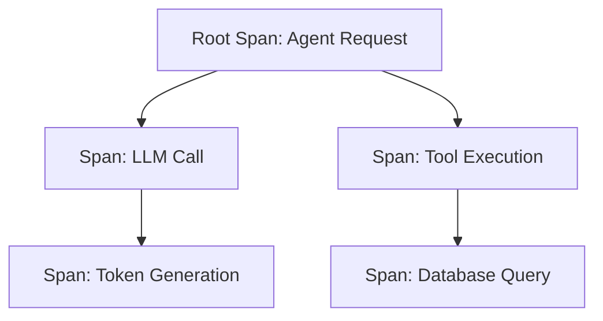
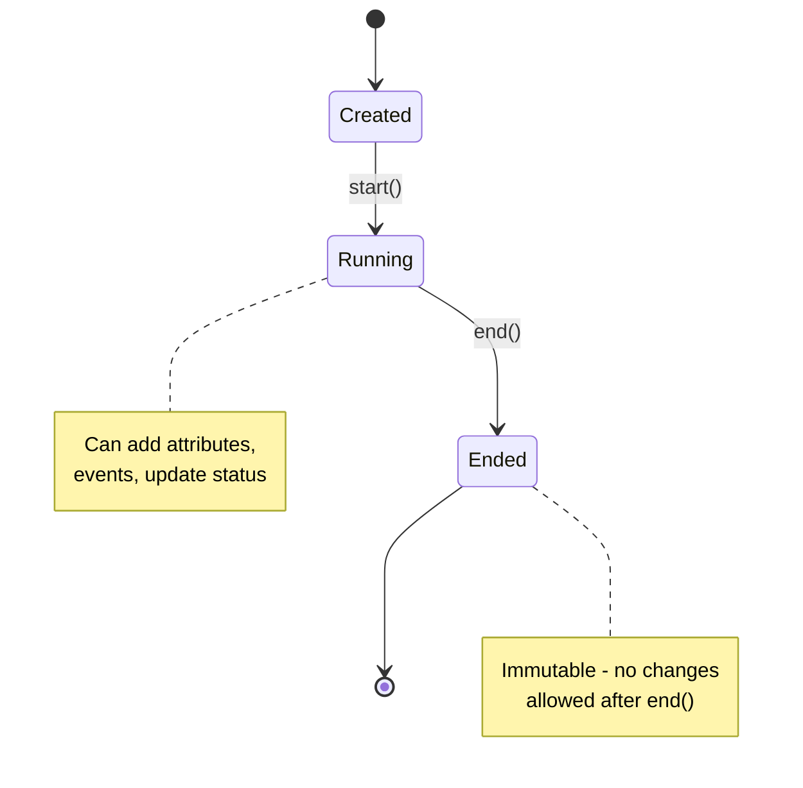

# Spans

Spans are the fundamental building blocks of distributed tracing in Prela. A span represents a unit of work in your AI agent system, such as an LLM call, tool invocation, or custom operation.

## Overview

Each span captures:

- **Identity**: Unique span ID and trace ID for correlation
- **Timing**: Start and end timestamps with nanosecond precision
- **Metadata**: Attributes, events, and status information
- **Hierarchy**: Parent-child relationships for nested operations



## Span Structure

```python
from prela import Span, SpanType, SpanStatus

span = Span(
    span_id="550e8400-e29b-41d4-a716-446655440000",
    trace_id="123e4567-e89b-12d3-a456-426614174000",
    parent_span_id=None,  # Root span
    name="agent.process_request",
    span_type=SpanType.AGENT,
    status=SpanStatus.SUCCESS,
    attributes={
        "user_id": "user123",
        "request_type": "chat"
    }
)
```

## Span Types

Prela provides semantic span types for different operations:

### SpanType.AGENT
Represents agent-level operations (reasoning, planning, orchestration).

```python
from prela import get_tracer, SpanType

with get_tracer().span("process_query", SpanType.AGENT) as span:
    span.set_attribute("query", "What's the weather?")
    # Agent logic here
```

### SpanType.LLM
Represents LLM API calls (automatically created by instrumentation).

```python
# Auto-instrumented LLM calls create LLM spans
from anthropic import Anthropic

client = Anthropic()
response = client.messages.create(...)  # Creates SpanType.LLM
```

### SpanType.TOOL
Represents tool or function calls made by the agent.

```python
with get_tracer().span("search_database", SpanType.TOOL) as span:
    span.set_attribute("tool.name", "database_search")
    span.set_attribute("tool.input", query)
    result = search(query)
    span.set_attribute("tool.output", result)
```

### SpanType.RETRIEVAL
Represents retrieval operations (vector search, RAG, knowledge base queries).

```python
with get_tracer().span("vector_search", SpanType.RETRIEVAL) as span:
    span.set_attribute("retrieval.query", text)
    span.set_attribute("retrieval.top_k", 10)
    docs = vector_db.search(text, k=10)
    span.set_attribute("retrieval.num_results", len(docs))
```

### SpanType.EMBEDDING
Represents embedding generation operations.

```python
with get_tracer().span("generate_embedding", SpanType.EMBEDDING) as span:
    span.set_attribute("embedding.model", "text-embedding-ada-002")
    span.set_attribute("embedding.input", text)
    embedding = model.embed(text)
    span.set_attribute("embedding.dimensions", len(embedding))
```

### SpanType.CUSTOM
Represents custom operations specific to your application.

```python
with get_tracer().span("custom_operation", SpanType.CUSTOM) as span:
    span.set_attribute("operation.type", "data_processing")
    # Custom logic
```

## Span Lifecycle

Spans follow a strict lifecycle:



### 1. Creation

```python
from prela import Span, SpanType
from datetime import datetime, timezone

span = Span(
    name="my_operation",
    span_type=SpanType.CUSTOM,
    started_at=datetime.now(timezone.utc)
)
```

### 2. Running (Mutable)

During execution, you can add attributes and events:

```python
# Add attributes
span.set_attribute("user_id", "user123")
span.set_attribute("model", "claude-sonnet-4")

# Add events
span.add_event("checkpoint_reached", {"step": 1})
span.add_event("cache_hit", {"key": "abc123"})
```

### 3. Completion (Immutable)

Once ended, spans become immutable:

```python
span.end()  # Status defaults to SUCCESS

# After end(), modifications raise RuntimeError
try:
    span.set_attribute("foo", "bar")
except RuntimeError as e:
    print(e)  # "Span has ended and is immutable"
```

### Error Handling

```python
try:
    # Operation that might fail
    result = risky_operation()
    span.set_attribute("result", result)
except Exception as e:
    span.set_status(SpanStatus.ERROR, str(e))
    raise
finally:
    span.end()
```

## Span Status

Spans have one of three statuses:

| Status | Description | Use Case |
|--------|-------------|----------|
| `PENDING` | Operation in progress | Default when span is created |
| `SUCCESS` | Operation completed successfully | Default when `end()` is called |
| `ERROR` | Operation failed | Set manually when exceptions occur |

```python
from prela import SpanStatus

# Manual status control
span.set_status(SpanStatus.SUCCESS)
span.set_status(SpanStatus.ERROR, "Connection timeout after 30s")

# Check current status
if span.status == SpanStatus.ERROR:
    print(f"Error: {span.status_message}")
```

## Attributes

Attributes are key-value metadata attached to spans. They provide context about the operation.

### Setting Attributes

```python
# Single attribute
span.set_attribute("user_id", "user123")

# Multiple attributes
span.set_attribute("model", "gpt-4")
span.set_attribute("temperature", 0.7)
span.set_attribute("max_tokens", 1000)

# Complex values (automatically serialized)
span.set_attribute("metadata", {"key": "value"})
```

### Recommended Attribute Conventions

For LLM operations:
```python
span.set_attribute("llm.vendor", "anthropic")
span.set_attribute("llm.model", "claude-sonnet-4-20250514")
span.set_attribute("llm.temperature", 1.0)
span.set_attribute("llm.input_tokens", 100)
span.set_attribute("llm.output_tokens", 50)
```

For tool operations:
```python
span.set_attribute("tool.name", "web_search")
span.set_attribute("tool.input", query)
span.set_attribute("tool.output", results)
```

For retrieval operations:
```python
span.set_attribute("retrieval.query", text)
span.set_attribute("retrieval.top_k", 5)
span.set_attribute("retrieval.num_results", 3)
```

## Events

Events are timestamped occurrences during span execution.

```python
from prela import SpanEvent
from datetime import datetime, timezone

# Add event with automatic timestamp
span.add_event("cache_miss", {"cache_key": "abc123"})

# Add event with explicit timestamp
span.add_event(
    "retry_attempted",
    {"attempt": 2, "delay_ms": 1000}
)

# Access events
for event in span.events:
    print(f"{event.timestamp}: {event.name}")
    print(f"  Attributes: {event.attributes}")
```

Common event types:
- `llm.request`: LLM request details
- `llm.response`: LLM response details
- `tool.call`: Tool invocation
- `cache.hit` / `cache.miss`: Cache access
- `retry.attempted`: Retry logic

## Context Manager Usage

The recommended way to use spans is with context managers:

```python
from prela import get_tracer, SpanType

# Basic usage
with get_tracer().span("my_operation") as span:
    span.set_attribute("key", "value")
    # Operation here
    # span.end() called automatically

# With span type
with get_tracer().span("llm_call", SpanType.LLM) as span:
    # LLM operation
    pass

# Nested spans
with get_tracer().span("parent_op", SpanType.AGENT) as parent:
    parent.set_attribute("stage", "planning")

    with get_tracer().span("child_op", SpanType.TOOL) as child:
        child.set_attribute("tool", "calculator")
        # Child operation
```

## Serialization

Spans can be serialized to/from dictionaries for storage or transmission:

```python
# Serialize to dict
span_dict = span.to_dict()
# {
#     "span_id": "...",
#     "trace_id": "...",
#     "name": "my_operation",
#     "span_type": "custom",
#     "status": "success",
#     ...
# }

# Deserialize from dict
from prela import Span
reconstructed = Span.from_dict(span_dict)
```

## Performance Considerations

Prela spans are designed for high performance:

- **Memory Efficient**: Uses `__slots__` to reduce memory overhead
- **Lazy Serialization**: Only serializes when exported
- **Immutability**: Ended spans can be safely shared across threads
- **Minimal Overhead**: Typical span creation adds <100 microseconds

```python
# Good: Minimal attributes for high-volume operations
with get_tracer().span("fast_op") as span:
    span.set_attribute("id", request_id)

# Avoid: Too many attributes in tight loops
# for i in range(10000):
#     with get_tracer().span(f"item_{i}") as span:
#         span.set_attribute("index", i)
#         span.set_attribute("data", large_dict)  # Expensive
```

## Best Practices

### 1. Use Semantic Span Types
```python
# Good
with get_tracer().span("query_db", SpanType.RETRIEVAL) as span:
    ...

# Less useful
with get_tracer().span("query_db", SpanType.CUSTOM) as span:
    ...
```

### 2. Add Relevant Attributes
```python
# Good: Useful for debugging and analysis
span.set_attribute("user_id", user_id)
span.set_attribute("model", model_name)
span.set_attribute("latency_ms", duration)

# Bad: Too much detail
span.set_attribute("entire_request_body", massive_json)
```

### 3. Use Events for Milestones
```python
span.add_event("validation_started")
# Validation logic
span.add_event("validation_completed", {"errors": 0})
```

### 4. Always Use Context Managers
```python
# Good: Automatic cleanup
with get_tracer().span("operation") as span:
    do_work()

# Bad: Manual lifecycle management
span = get_tracer().start_span("operation")
try:
    do_work()
finally:
    span.end()  # Easy to forget!
```

### 5. Set Error Status on Exceptions
```python
with get_tracer().span("risky_op") as span:
    try:
        risky_operation()
    except Exception as e:
        span.set_status(SpanStatus.ERROR, str(e))
        raise
```

## Next Steps

- Learn about [Context Propagation](context.md) for distributed tracing
- Explore [Sampling](sampling.md) to control trace volume
- See [Exporters](exporters.md) for sending traces to backends
