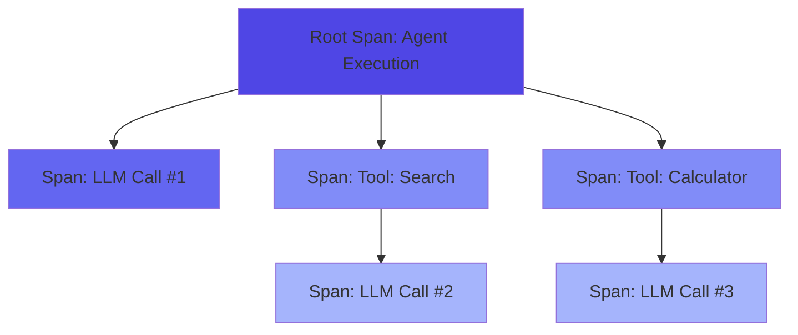
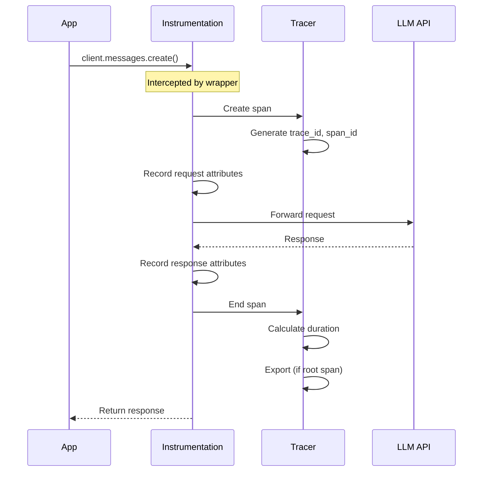
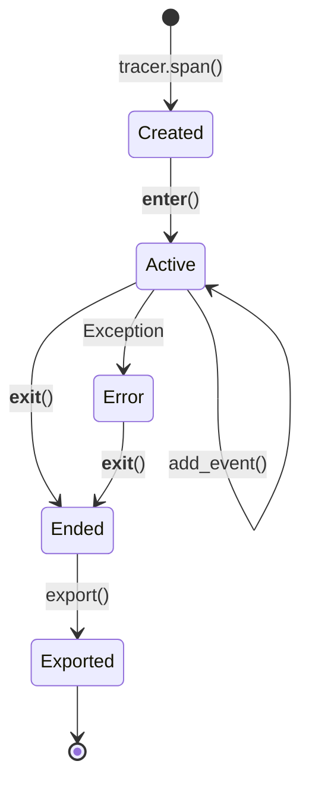

# Distributed Tracing

Understanding how Prela traces AI agent execution.

---

## What is Tracing?

**Tracing** tracks the flow of execution through your application. Each operation (LLM call, tool invocation, agent step) creates a **span** that records:

- When it started and ended
- What inputs and outputs it had
- Whether it succeeded or failed
- How long it took

Spans are organized into **traces** - a tree of related operations representing a single request or workflow.

---

## Anatomy of a Trace



Each span has:

- **Trace ID**: Unique identifier for the entire trace
- **Span ID**: Unique identifier for this span
- **Parent Span ID**: Links to parent span (if not root)
- **Name**: Human-readable operation name
- **Type**: AGENT, LLM, TOOL, RETRIEVAL, EMBEDDING, CUSTOM
- **Status**: PENDING, SUCCESS, ERROR
- **Timestamps**: Start and end times
- **Duration**: Calculated from timestamps
- **Attributes**: Key-value metadata
- **Events**: Timestamped events during execution

---

## How Prela Traces Work

### 1. Initialization

When you call `prela.init()`:

```python
import prela

prela.init(service_name="my-agent")
```

Prela:

1. Creates a **global tracer**
2. **Auto-instruments** installed LLM SDKs (OpenAI, Anthropic, etc.)
3. Sets up **context propagation** for threads and async

### 2. Automatic Span Creation

When you call an LLM API:

```python
from anthropic import Anthropic

client = Anthropic()
response = client.messages.create(
    model="claude-sonnet-4-20250514",
    messages=[{"role": "user", "content": "Hello"}]
)
```

Behind the scenes:



### 3. Context Propagation

Prela uses Python's `contextvars` to track the current span:

```python
import prela

tracer = prela.get_tracer()

# Root span
with tracer.span("agent_execution"):
    # Child span (automatically linked)
    with tracer.span("tool_call"):
        # Grandchild span (automatically linked)
        llm_response = client.messages.create(...)
```

Resulting trace tree:

```
agent_execution
├── tool_call
│   └── anthropic.messages.create
```

### 4. Thread Safety

Prela is safe for multi-threaded applications:

```python
from concurrent.futures import ThreadPoolExecutor

def process_query(query):
    # Each thread has its own trace context
    with tracer.span("process_query"):
        response = client.messages.create(
            model="claude-sonnet-4-20250514",
            messages=[{"role": "user", "content": query}]
        )
        return response

with ThreadPoolExecutor(max_workers=4) as executor:
    results = executor.map(process_query, queries)
```

### 5. Async Support

Prela works with async/await:

```python
import asyncio
from anthropic import AsyncAnthropic

async def process_async(query):
    client = AsyncAnthropic()

    # Automatic tracing in async context
    with tracer.span("async_process"):
        response = await client.messages.create(
            model="claude-sonnet-4-20250514",
            messages=[{"role": "user", "content": query}]
        )
        return response

await asyncio.gather(*[process_async(q) for q in queries])
```

---

## Span Attributes

Spans capture rich metadata:

### Service Attributes

- `service.name`: Your service name (from `prela.init()`)

### LLM Attributes

- `llm.vendor`: Provider (openai, anthropic)
- `llm.model`: Model name
- `llm.temperature`: Temperature parameter
- `llm.max_tokens`: Max tokens parameter
- `llm.input_tokens`: Tokens in request
- `llm.output_tokens`: Tokens in response
- `llm.total_tokens`: Sum of input/output
- `llm.latency_ms`: Response latency
- `llm.finish_reason`: Completion reason
- `llm.stop_reason`: Stop reason

### Tool Attributes

- `tool.name`: Tool name
- `tool.arguments`: Tool arguments (JSON)

### Error Attributes

- `error.type`: Exception class name
- `error.message`: Exception message
- `error.stacktrace`: Full stack trace

---

## Span Events

Events are timestamped logs within a span:

```python
{
  "name": "llm.request",
  "timestamp": "2025-01-26T10:00:00.123456Z",
  "attributes": {
    "messages": [{"role": "user", "content": "Hello"}]
  }
}
```

Common events:

- `llm.request`: LLM request sent
- `llm.response`: LLM response received
- `tool.call`: Tool invoked
- `tool.result`: Tool returned result

---

## Best Practices

### 1. Meaningful Span Names

Use descriptive, consistent names:

```python
# Good
with tracer.span("fetch_user_data"):
    ...

with tracer.span("generate_response"):
    ...

# Bad
with tracer.span("function1"):
    ...

with tracer.span("do_stuff"):
    ...
```

### 2. Appropriate Span Granularity

Don't create spans for trivial operations:

```python
# Good: One span for the whole process
with tracer.span("process_document"):
    text = extract_text(doc)
    summary = summarize(text)
    return summary

# Bad: Too granular
with tracer.span("process_document"):
    with tracer.span("extract_text"):
        text = extract_text(doc)
    with tracer.span("summarize"):
        summary = summarize(text)
    return summary
```

### 3. Add Context with Attributes

Enrich spans with relevant metadata:

```python
with tracer.span("query_database") as span:
    span.set_attribute("query", sql_query)
    span.set_attribute("database", db_name)
    result = execute_query(sql_query)
    span.set_attribute("rows_returned", len(result))
```

### 4. Record Events for Milestones

```python
with tracer.span("agent_workflow") as span:
    span.add_event("planning_started")
    plan = create_plan()

    span.add_event("execution_started")
    result = execute_plan(plan)

    span.add_event("validation_started")
    validate(result)
```

### 5. Handle Errors Properly

Errors are automatically captured, but you can add context:

```python
with tracer.span("risky_operation") as span:
    try:
        result = dangerous_function()
    except ValueError as e:
        span.set_attribute("error.context", "Invalid input format")
        raise  # Re-raise to mark span as error
```

---

## Trace Lifecycle



1. **Created**: `tracer.span()` called
2. **Active**: Context entered, span can be modified
3. **Ended**: Context exited, span immutable
4. **Exported**: Sent to exporter (only root spans)

---

## Performance Considerations

### Overhead

Prela adds minimal overhead:

- **Span creation**: ~0.1ms
- **Attribute setting**: ~0.01ms per attribute
- **Event recording**: ~0.01ms per event
- **Export**: Happens asynchronously (root spans only)

Total: ~0.5-2ms per span

### Sampling

Reduce overhead in high-traffic systems:

```python
prela.init(
    service_name="high-traffic-agent",
    sample_rate=0.01  # Sample 1% of traces
)
```

See [Sampling](sampling.md) for details.

---

## Next Steps

- [Spans](spans.md) - Deep dive into span internals
- [Context Propagation](context.md) - Thread and async context
- [Sampling](sampling.md) - Control trace volume
- [Exporters](exporters.md) - Where traces go
