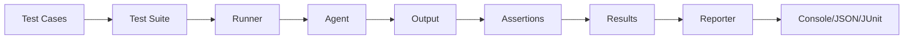

# Evaluation Framework

Prela's evaluation framework provides a comprehensive system for testing AI agents with assertions, test suites, and CI/CD integration.

## Overview

The evaluation framework helps you:

- **Define test cases** with inputs and expected outputs
- **Run assertions** to validate agent behavior
- **Execute test suites** sequentially or in parallel
- **Generate reports** in multiple formats (console, JSON, JUnit)
- **Integrate with CI/CD** for automated testing



## Quick Start

```python
from prela.evals import EvalCase, EvalInput, EvalExpected, EvalSuite, EvalRunner

# Define test case
case = EvalCase(
    id="test_qa",
    name="Basic QA Test",
    input=EvalInput(query="What is 2+2?"),
    expected=EvalExpected(contains=["4"])
)

# Create suite
suite = EvalSuite(name="Math Tests", cases=[case])

# Define your agent
def my_agent(input_data):
    query = input_data.get("query", "")
    if "2+2" in query:
        return "The answer is 4"
    return "I don't know"

# Run evaluation
runner = EvalRunner(suite, my_agent)
result = runner.run()

# View results
print(result.summary())
# Evaluation Suite: Math Tests
# Total Cases: 1
# Passed: 1 (100.0%)
```

## Core Components

### 1. EvalCase

A test case defines:
- **Input**: Data to pass to your agent
- **Expected**: What the output should contain/match
- **Assertions**: Validation rules
- **Metadata**: Tags, timeout, description

```python
from prela.evals import EvalCase, EvalInput, EvalExpected

case = EvalCase(
    id="test_greeting",
    name="Greeting Test",
    input=EvalInput(
        query="Say hello",
        context={"language": "english"}
    ),
    expected=EvalExpected(
        contains=["hello", "hi"],
        not_contains=["error"]
    ),
    tags=["greeting", "basic"],
    timeout_seconds=5.0
)
```

### 2. EvalSuite

A collection of test cases with optional setup/teardown:

```python
from prela.evals import EvalSuite

suite = EvalSuite(
    name="Agent Test Suite",
    cases=[case1, case2, case3],
    setup=lambda: print("Setting up..."),
    teardown=lambda: print("Cleaning up..."),
    default_assertions=[
        {"type": "latency", "max_ms": 2000}
    ]
)
```

### 3. Assertions

Validation rules that check agent outputs:

```python
# Simple expectations
expected = EvalExpected(
    contains=["success"],          # Must contain
    not_contains=["error"],        # Must not contain
)

# Advanced assertions
assertions = [
    {"type": "contains", "value": "result"},
    {"type": "regex", "pattern": r"\d+"},
    {"type": "json_valid"},
    {"type": "semantic_similarity", "threshold": 0.8, "reference": "..."},
    {"type": "tool_called", "tool_name": "search"},
]
```

### 4. EvalRunner

Executes test suites and collects results:

```python
from prela.evals import EvalRunner

runner = EvalRunner(
    suite=suite,
    agent_fn=my_agent,
    parallel=True,          # Run tests in parallel
    max_workers=4,          # Parallel workers
    tracer=tracer           # Optional: trace test execution
)

result = runner.run()
```

### 5. Reporters

Generate results in different formats:

```python
from prela.evals.reporters import ConsoleReporter, JSONReporter, JUnitReporter

# Console output
ConsoleReporter(verbosity="verbose").report(result)

# JSON file
JSONReporter("results.json").report(result)

# JUnit XML (for CI/CD)
JUnitReporter("junit.xml").report(result)
```

## Assertion Types

### Structural Assertions

- **contains**: Text must be present
- **not_contains**: Text must not be present
- **regex**: Match regex pattern
- **length**: Output length constraints
- **json_valid**: Valid JSON output
- **latency**: Response time limits

### Tool Assertions

- **tool_called**: Specific tool was invoked
- **tool_args**: Tool called with correct arguments
- **tool_sequence**: Tools called in order

### Semantic Assertions

- **semantic_similarity**: Semantic similarity to reference

## YAML/JSON Support

Define test suites in YAML or JSON:

```yaml
# tests.yaml
name: Agent Test Suite
cases:
  - id: test_greeting
    name: Greeting Test
    input:
      query: "Say hello"
    expected:
      contains: ["hello"]
    tags: ["greeting"]

  - id: test_math
    name: Math Test
    input:
      query: "What is 5+3?"
    expected:
      contains: ["8"]
    tags: ["math"]
```

Load and run:

```python
from prela.evals import EvalSuite

suite = EvalSuite.from_yaml("tests.yaml")
runner = EvalRunner(suite, my_agent)
result = runner.run()
```

## CLI Integration

Run evaluations from the command line:

```bash
# Run test suite
prela eval run tests.yaml --agent my_agent.py

# With custom reporter
prela eval run tests.yaml --agent my_agent.py --format junit --output results.xml

# Parallel execution
prela eval run tests.yaml --agent my_agent.py --parallel --workers 8
```

## CI/CD Integration

### GitHub Actions

```yaml
name: Run Evaluations

on: [push, pull_request]

jobs:
  test:
    runs-on: ubuntu-latest
    steps:
      - uses: actions/checkout@v2
      - uses: actions/setup-python@v2
      - run: pip install prela

      - name: Run evaluations
        run: |
          prela eval run tests.yaml --agent agent.py --format junit --output results.xml

      - name: Publish test results
        uses: EnricoMi/publish-unit-test-result-action@v2
        if: always()
        with:
          files: results.xml
```

### GitLab CI

```yaml
test:
  script:
    - pip install prela
    - prela eval run tests.yaml --agent agent.py --format junit --output results.xml
  artifacts:
    reports:
      junit: results.xml
```

## Observability Integration

Trace test execution with Prela's tracer:

```python
import prela
from prela.evals import EvalRunner

# Initialize tracer
tracer = prela.init(service_name="eval-runner", exporter="console")

# Run with tracing
runner = EvalRunner(suite, my_agent, tracer=tracer)
result = runner.run()

# Each test case execution is captured as a span
# View complete trace of agent behavior during tests
```

## Best Practices

### 1. Organize Tests by Feature

```python
qa_suite = EvalSuite(name="QA Tests", cases=qa_cases, tags=["qa"])
rag_suite = EvalSuite(name="RAG Tests", cases=rag_cases, tags=["rag"])
tool_suite = EvalSuite(name="Tool Tests", cases=tool_cases, tags=["tools"])
```

### 2. Use Tags for Filtering

```python
case = EvalCase(
    id="test_1",
    tags=["smoke", "critical", "qa"]
)

# Filter by tags (future feature)
# runner.run(tags=["smoke"])
```

### 3. Set Appropriate Timeouts

```python
# Fast operations
case = EvalCase(..., timeout_seconds=2.0)

# LLM calls
case = EvalCase(..., timeout_seconds=30.0)

# Complex workflows
case = EvalCase(..., timeout_seconds=120.0)
```

### 4. Combine Multiple Assertions

```python
case = EvalCase(
    id="test_comprehensive",
    expected=EvalExpected(
        contains=["result"],
        not_contains=["error"]
    ),
    assertions=[
        {"type": "latency", "max_ms": 5000},
        {"type": "json_valid"},
        {"type": "length", "min": 10, "max": 500},
    ]
)
```

### 5. Use Setup/Teardown

```python
def setup():
    """Initialize test environment."""
    db.connect()
    cache.clear()

def teardown():
    """Clean up after tests."""
    db.disconnect()

suite = EvalSuite(
    name="Integration Tests",
    cases=cases,
    setup=setup,
    teardown=teardown
)
```

## Example Workflows

### Regression Testing

```python
# Define expected behaviors
regression_cases = [
    EvalCase(
        id=f"regression_{i}",
        input=EvalInput(query=query),
        expected=EvalExpected(output=known_good_output)
    )
    for i, (query, known_good_output) in enumerate(test_data)
]

suite = EvalSuite(name="Regression Tests", cases=regression_cases)
result = EvalRunner(suite, agent).run()

# Fail CI if regressions detected
assert result.pass_rate == 1.0, f"Regressions detected: {result.failed} failures"
```

### A/B Testing

```python
# Test two agent versions
result_v1 = EvalRunner(suite, agent_v1).run()
result_v2 = EvalRunner(suite, agent_v2).run()

print(f"V1 pass rate: {result_v1.pass_rate:.1%}")
print(f"V2 pass rate: {result_v2.pass_rate:.1%}")

# Deploy version with better performance
```

### Performance Benchmarking

```python
# Add latency assertions to all cases
suite.default_assertions = [
    {"type": "latency", "max_ms": 2000}
]

result = EvalRunner(suite, agent, parallel=True, max_workers=10).run()

# Analyze performance
for case_result in result.case_results:
    print(f"{case_result.case_name}: {case_result.duration_ms:.0f}ms")
```

## Next Steps

- Learn [Writing Tests](writing-tests.md)
- Explore [Assertions](assertions.md)
- See [Running Evaluations](running.md)
- Set up [CI Integration](ci-integration.md)
