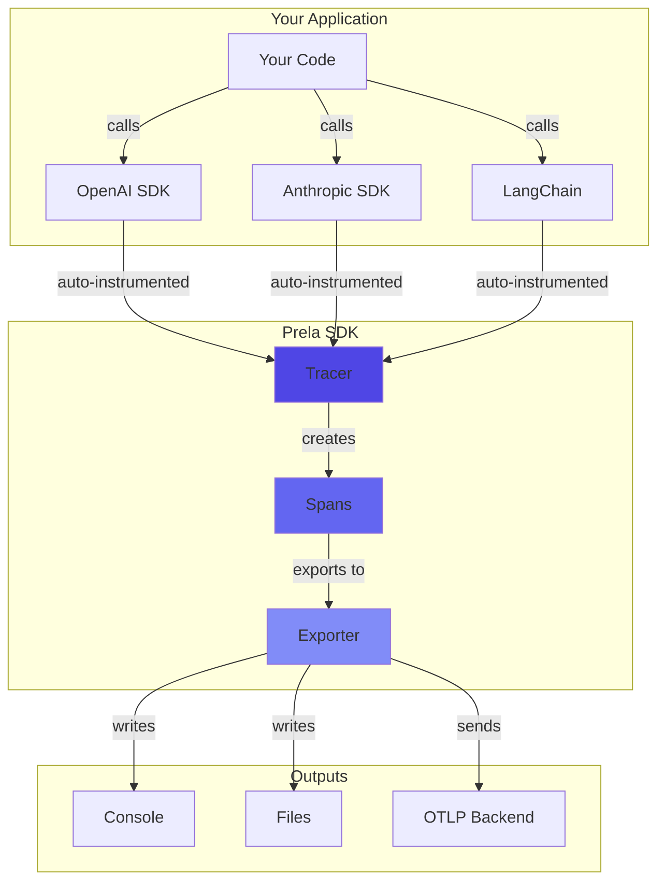
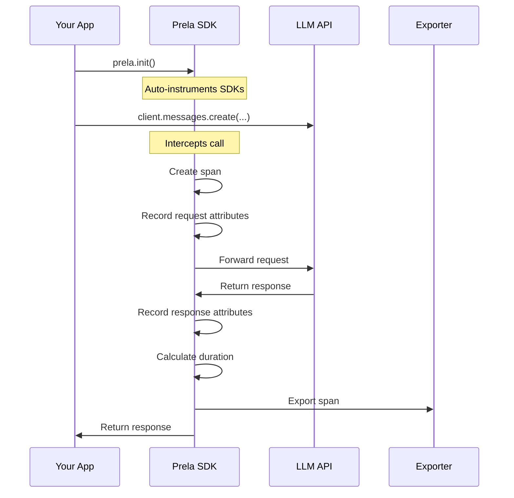

# Prela

**Observability for AI Agents**

Prela is a production-ready Python SDK for tracing, monitoring, and evaluating autonomous AI agents. Get complete visibility into what your LLM-powered applications are doing with zero-code auto-instrumentation.

!!! success "Production Validated"
    ✅ **21/21 core features validated** with real API calls
    ✅ **4/4 performance criteria met** (SDK overhead <5%, CLI <1s response)
    ✅ **1,068 passing tests** with 100% coverage on new code
    ✅ **Ready for PyPI publication**

---

## Why Prela?

Building AI agents is hard. Understanding what they're doing is even harder. Prela solves this by providing:

- **🔍 Automatic Tracing**: Zero-code instrumentation for 10 frameworks (OpenAI, Anthropic, LangChain, LlamaIndex, CrewAI, AutoGen, LangGraph, Swarm, n8n)
- **🤖 Multi-Agent Support**: First-class support for multi-agent orchestration, conversations, and handoffs
- **📊 Complete Visibility**: See every LLM call, tool invocation, agent decision, and state change
- **🧪 Built-in Testing**: Comprehensive evaluation framework with 17+ assertion types including multi-agent and workflow patterns
- **🔄 Deterministic Replay**: Re-execute traces with different models, compare outputs, test tool execution
- **🚀 Production Ready**: 1,068 tests, 100% coverage on new code, type-safe, minimal dependencies
- **⚡ Minimal Overhead**: ~0.5-2ms per span, smart sampling, efficient serialization

---

## Quick Start

Install Prela:

```bash
pip install prela
```

Add one line to your code:

```python
import prela
from anthropic import Anthropic

# Initialize Prela - auto-instruments all LLM SDKs
prela.init(service_name="my-agent")

# Use your LLM SDK normally - tracing happens automatically!
client = Anthropic()
response = client.messages.create(
    model="claude-sonnet-4-20250514",
    messages=[{"role": "user", "content": "Hello!"}]
)

# Spans are automatically created, traced, and exported ✨
```

That's it! All your LLM calls are now traced with:

- Request/response attributes (model, tokens, latency)
- Tool calls and function invocations
- Error capture and stack traces
- Parent-child span relationships

---

## Architecture Overview



---

## Key Features

### 🎯 Auto-Instrumentation

Works out of the box with 10 popular frameworks:

=== "OpenAI"
    ```python
    import prela
    import openai

    prela.init()

    # Automatically traced
    response = openai.chat.completions.create(
        model="gpt-4",
        messages=[{"role": "user", "content": "Hello"}]
    )
    ```

=== "Anthropic"
    ```python
    import prela
    from anthropic import Anthropic

    prela.init()

    # Automatically traced
    client = Anthropic()
    response = client.messages.create(
        model="claude-sonnet-4-20250514",
        messages=[{"role": "user", "content": "Hello"}]
    )
    ```

=== "LangChain"
    ```python
    import prela
    from langchain.agents import initialize_agent

    prela.init()

    # Automatically traced
    agent = initialize_agent(tools, llm, agent="zero-shot-react-description")
    result = agent.run("What is the weather?")
    ```

=== "CrewAI"
    ```python
    import prela
    from crewai import Agent, Task, Crew

    prela.init()

    # Automatically traced - task delegation, agent collaboration
    crew = Crew(agents=[researcher, writer], tasks=[research_task, write_task])
    result = crew.kickoff()
    ```

=== "AutoGen"
    ```python
    import prela
    from autogen import ConversableAgent

    prela.init()

    # Automatically traced - conversations, message flow
    user_proxy.initiate_chat(assistant, message="Hello!")
    ```

=== "LangGraph"
    ```python
    import prela
    from langgraph.graph import StateGraph

    prela.init()

    # Automatically traced - state changes, node execution
    graph = StateGraph(state_schema={...})
    compiled = graph.compile()
    result = compiled.invoke(state)
    ```

=== "n8n"
    ```python
    import prela

    # Start webhook receiver for n8n workflows (multi-tenant support)
    prela.init(n8n_webhook_port=8787)

    # Configure n8n to send webhooks to http://localhost:8787
    # - All workflow executions, AI nodes, and tool calls automatically traced
    # - Multi-tenant: Monitor multiple n8n instances with project isolation
    # - Real-time dashboard with WebSocket updates (<1s latency)
    # - Webhook URL routing: ?project=prod-n8n or header X-Prela-Project
    ```

### 📈 Complete Span Data

Every span captures:

- **Timing**: Start time, end time, duration
- **Attributes**: Model, temperature, max tokens, token usage
- **Events**: Request sent, response received, tool calls
- **Errors**: Exception type, message, stack trace
- **Context**: Trace ID, span ID, parent span ID

### 🤖 Multi-Agent Observability

First-class support for multi-agent systems:

**CrewAI** - Task-based orchestration:
- Crew executions with agent collaboration
- Task delegation tracking (assigner → assignee)
- Tool usage per agent
- Sequential vs hierarchical process modes

**AutoGen** - Conversational agents:
- Multi-turn conversation tracking
- Message flow (speaker → recipient)
- Function calling with agent context
- Turn-by-turn conversation history

**LangGraph** - Stateful workflows:
- Graph execution with node tracing
- State change detection (what each node modified)
- Streaming support with step counting
- Support for prebuilt agents (create_react_agent)

**Swarm** - Agent handoffs:
- Handoff tracking (initial → final agent)
- Context variable flow (privacy-safe keys)
- Deterministic agent IDs
- Execution isolation for concurrent runs

See [Multi-Agent Integrations](integrations/crewai.md) for detailed documentation.

### 🧪 Evaluation Framework

Test your agents systematically:

```python
from prela.evals import EvalSuite, EvalCase, EvalInput, EvalExpected
from prela.evals import EvalRunner
from prela.evals.reporters import ConsoleReporter

# Define test cases
suite = EvalSuite(
    name="Customer Support Bot",
    cases=[
        EvalCase(
            id="test_greeting",
            name="Responds to greeting",
            input=EvalInput(query="Hello!"),
            expected=EvalExpected(contains=["Hi", "Hello"]),
        ),
    ]
)

# Run evaluation
runner = EvalRunner(suite, agent_function=my_agent)
result = runner.run()

# Report results
ConsoleReporter(verbose=True).report(result)
```

### 🔄 Deterministic Replay

Re-execute captured traces with modifications for testing and experimentation:

```python
from prela.replay import ReplayEngine, TraceLoader

# Load captured trace
trace = TraceLoader.from_file("trace.json")

# Replay with different model
engine = ReplayEngine(trace)
result = engine.replay_with_modifications(
    model="gpt-4o",           # Try different model
    temperature=0.7,          # Adjust parameters
    enable_tools=True,        # Re-execute tool calls
    enable_retrieval=True     # Re-execute vector searches
)

# Compare original vs replayed execution
comparison = result.compare_with_original()
print(f"Output similarity: {comparison.semantic_similarity:.2%}")
print(f"Token difference: {comparison.token_difference}")
```

**Replay capabilities:**
- Switch between models (OpenAI ↔ Anthropic)
- Adjust temperature, max tokens, and other parameters
- Re-execute tool calls with allowlist/blocklist controls
- Re-execute retrieval operations with vector DB support
- Automatic retry logic with exponential backoff
- Semantic similarity comparison with fallback methods
- Side-by-side diff visualization

See [Replay Concepts](concepts/replay.md) and [Replay Examples](examples/replay.md) for detailed documentation.

### 📊 Multiple Export Formats

Choose your output:

- **Console**: Pretty-printed JSON for development
- **File**: JSONL format for production (with rotation)
- **OTLP**: OpenTelemetry protocol for cloud backends

---

## What Gets Traced?



**Captured automatically:**

- Model name and provider
- Input/output token counts
- Request parameters (temperature, max_tokens, etc.)
- Response metadata (finish_reason, stop_reason)
- Tool/function calls with arguments
- Streaming metrics (time-to-first-token)
- Errors and exceptions

---

## Use Cases

### 🐛 Debugging

Find out why your agent is misbehaving:

```bash
# List recent traces
prela list

# Show detailed trace
prela show trace_abc123

# Search for errors
prela search --status error
```

### 📊 Monitoring

Track performance in production:

```python
prela.init(
    service_name="production-agent",
    exporter="file",
    directory="./traces",
    sample_rate=0.1  # Sample 10% of traces
)
```

### ✅ Testing

Validate agent behavior:

```yaml
# eval_suite.yaml
name: Agent Test Suite
cases:
  - id: test_1
    name: Booking flow
    input:
      query: "Book a flight to NYC"
    expected:
      contains:
        - "flight"
        - "New York"
```

```bash
prela eval run eval_suite.yaml --reporter junit --output results.xml
```

### 🔬 Analysis

Export traces for analysis:

```python
from prela.evals.reporters import JSONReporter

# Export to JSON for analysis
JSONReporter("analysis/results.json").report(eval_result)
```

---

## Documentation

### Getting Started
- [Installation](getting-started/installation.md) - Install Prela
- [Quick Start](getting-started/quickstart.md) - First trace in 5 minutes
- [Configuration](getting-started/configuration.md) - Configuration options

### Concepts
- [Tracing](concepts/tracing.md) - Distributed tracing fundamentals
- [Spans](concepts/spans.md) - Understanding spans
- [Context Propagation](concepts/context.md) - Thread and async safety
- [Sampling](concepts/sampling.md) - Control trace volume
- [Exporters](concepts/exporters.md) - Where traces go

### Integrations

**LLM Providers:**
- [OpenAI](integrations/openai.md) - GPT-3.5, GPT-4, embeddings
- [Anthropic](integrations/anthropic.md) - Claude models

**Agent Frameworks:**
- [LangChain](integrations/langchain.md) - Chains and agents
- [LlamaIndex](integrations/llamaindex.md) - Query engines

**Multi-Agent Frameworks:**
- [CrewAI](integrations/crewai.md) - Task-based orchestration
- [AutoGen](integrations/autogen.md) - Conversational agents
- [LangGraph](integrations/langgraph.md) - Stateful workflows
- [Swarm](integrations/swarm.md) - Agent handoffs

**Workflow Automation:**
- [n8n](integrations/n8n.md) - Webhook-based workflow tracing
- [n8n Code Nodes](integrations/n8n-code-nodes.md) - Python code instrumentation

### Evaluation
- [Overview](evals/overview.md) - Testing framework
- [Writing Tests](evals/writing-tests.md) - Create test cases
- [Assertions](evals/assertions.md) - 10 assertion types for agent outputs
- [Multi-Agent Assertions](evals/multi-agent-assertions.md) - 7 assertion types for multi-agent systems
- [N8N Workflow Evaluation](evals/n8n-workflows.md) - Test n8n workflows systematically
- [Running Evaluations](evals/running.md) - Execution modes
- [CI Integration](evals/ci-integration.md) - GitHub Actions, Jenkins

### Replay
- [Replay Concepts](concepts/replay.md) - Deterministic replay fundamentals
- [Replay Advanced](concepts/replay-advanced.md) - Tool/retrieval re-execution
- [Replay Examples](examples/replay.md) - Basic replay scenarios
- [Replay Multi-Agent](examples/replay-multi-agent.md) - Multi-agent replay patterns
- [Replay with Tools](examples/replay-with-tools.md) - Tool re-execution examples

---

## Community & Support

- **GitHub**: [github.com/garrettw2200/prela-sdk](https://github.com/garrettw2200/prela-sdk)
- **PyPI**: [pypi.org/project/prela](https://pypi.org/project/prela/)
- **Issues**: [Report bugs or request features](https://github.com/garrettw2200/prela-sdk/issues)
- **Discussions**: [Ask questions and share ideas](https://github.com/garrettw2200/prela-sdk/discussions)
- **Discord**: [Join our community](https://discord.gg/bCMfHnZD)
- **License**: Apache 2.0 (Open Source)

---

## What's Next?

<div class="grid cards" markdown>

-   :material-download:{ .lg .middle } **Install Prela**

    ---

    Get started with Prela in minutes

    [:octicons-arrow-right-24: Installation guide](getting-started/installation.md)

-   :material-lightning-bolt:{ .lg .middle } **Quick Start**

    ---

    Your first trace in 5 minutes

    [:octicons-arrow-right-24: Quick start](getting-started/quickstart.md)

-   :material-book-open-variant:{ .lg .middle } **Learn Concepts**

    ---

    Understand how Prela works

    [:octicons-arrow-right-24: Concepts](concepts/tracing.md)

-   :material-code-braces:{ .lg .middle } **API Reference**

    ---

    Detailed API documentation

    [:octicons-arrow-right-24: API docs](api/core.md)

</div>
